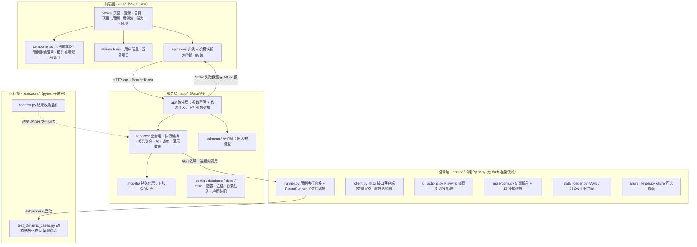

# ARCHITECTURE.md

> auto-test-platform 的技术架构文档。
> 目标读者是需要读懂、修改或扩展这份代码的开发者。内容涵盖分层结构、一次执行的数据流、各模块职责、扩展方式与设计动机。

---

## 目录

- [1. 整体架构](#1-整体架构)
- [2. 一次测试执行的完整数据流](#2-一次测试执行的完整数据流)
- [3. 各模块职责说明](#3-各模块职责说明)
- [4. 数据模型](#4-数据模型)
- [5. 跨层契约](#5-跨层契约)
- [6. 并发模型与执行控制](#6-并发模型与执行控制)
- [7. 用例数据模型](#7-用例数据模型)
- [8. 断言引擎](#8-断言引擎)
- [9. UI 自动化](#9-ui-自动化)
- [10. AI 子系统](#10-ai-子系统)
- [11. 认证与鉴权](#11-认证与鉴权)
- [12. 定时调度](#12-定时调度)
- [13. 报告与产物](#13-报告与产物)
- [14. 配置与日志](#14-配置与日志)
- [15. 前端架构](#15-前端架构)
- [16. 扩展指南](#16-扩展指南)
- [17. 为什么这样设计](#17-为什么这样设计)
- [18. 已知技术债](#18-已知技术债)

---

## 1. 整体架构

### 1.1 分层图



### 1.2 依赖规则（硬约束）

```
web  →  app  →  engine          允许
engine  →  app                  禁止
engine  →  web                  禁止
app  →  web                     禁止
```

这条规则在代码里有明确的落点——`testcases/conftest.py` 的文件头注释就是它的看门人：

> 本文件必须保持「零业务依赖」——它不能 import `app/` 下的任何模块，否则引擎层就无法脱离 Web 独立运行了。

`app` 与 `engine` 之间目前只有两处 import，方向都是单向的：

| 位置 | 导入内容 | 用途 |
| --- | --- | --- |
| `app/services/test_runner.py` | `PytestRunner`, `RunSummary` | 发起执行、读取汇总 |
| `app/services/seed.py` | `DataLoader`, `DataLoadError` | 加载内置演示用例 |

**代码评审检查点**：任何让 `engine/` 或 `testcases/` 出现 `from app...` / `import app...` 的改动，都会破坏引擎层的独立可运行性，应当直接拒绝。

### 1.3 三层职责边界

| 层 | 负责 | 明确不负责 |
| --- | --- | --- |
| 前端层 `web/` | 可视化交互、表单校验、token 与当前项目状态、报告渲染 | 任何业务规则判定、直接拼接后端地址 |
| 服务层 `app/` | 认证鉴权、持久化、执行编排、统计聚合、AI 调用、定时调度、静态资源托管 | 测试执行细节（HTTP 请求怎么发、断言怎么比、浏览器怎么点） |
| 引擎层 `engine/` | 用例执行内核、接口客户端、UI 动作、断言引擎、用例加载 | 持久化、权限、HTTP 服务、日志存储 |
| 运行期 `testcases/` | 把平台下发的用例参数化成 pytest 测试项、收集结果并写出 | 任何业务逻辑（含 import `app/`） |

### 1.4 运行时拓扑

**开发形态**

```
Vite Dev Server (:5173)                 FastAPI (uvicorn, :8000)
  ├─ /api    ──── proxy ───────────────────→  /api/*
  └─ /static ──── proxy ───────────────────→  /static/*
```

代理配置见 `web/vite.config.ts`。开发期前后端同源，不存在跨域问题；`CORS_ORIGINS` 主要服务于直连后端端口的调试场景。

**生产形态**

```
Browser ──→ nginx (:80, web/nginx.conf)
              ├─ /            → SPA，try_files 回退 index.html
              ├─ /api/        → http://backend:8000
              └─ /static/     → http://backend:8000
```

容器编排见 `docker-compose.yml`：`web` 服务基于 nginx 托管前端构建产物，`backend` 服务运行 uvicorn，两者通过 compose 网络以服务名互相解析。浏览器只需访问 nginx 暴露的端口，同样不存在跨域。

**进程模型**

```
uvicorn 主进程
 ├─ FastAPI 应用
 │    └─ lifespan：建表 → 初始化演示数据 → 启动 APScheduler
 ├─ ThreadPoolExecutor(max_workers=MAX_CONCURRENT_TASKS)   任务调度
 └─ 每个任务：subprocess.run(python -m pytest ...)          用例执行
```

关键点：**真正的用例执行发生在子进程里，主进程只做编排与结果落库。** 被测逻辑的崩溃、内存泄漏与 GIL 占用都不会影响 Web 服务的响应能力。

---

## 2. 一次测试执行的完整数据流

### 2.1 触发入口

| 入口 | 接口 | 说明 |
| --- | --- | --- |
| 单条执行 | `POST /api/testcases/{case_id}/run` | 跑一条用例，可用 `environment_id` 查询参数指定环境 |
| 批量执行 | `POST /api/testcases/batch-run` | 勾选多条用例，请求体 `{case_ids, environment_id, retry_times, name}` |
| 用例集执行 | `POST /api/testsuites/{suite_id}/run` | 按用例集执行，可覆盖环境与重跑次数 |
| 整任务重跑 | `POST /api/tasks/{task_id}/retry` | 复制原任务配置，新建一条 `pending` 任务，不修改原记录 |
| 定时触发 | APScheduler → `scheduler.trigger_suite()` | 与用例集执行同链路，`trigger_type=schedule` |

### 2.2 完整时序

```
①  用户在前端点「执行」
        │
②  路由层（app/api/testcases.py）
        │   · 查用例，校验存在性
        │   · TestRunnerService(db).create_task(...)
        │       - 生成 task_no = uuid4().hex
        │       - 解析环境：显式指定 > 项目默认 > 项目第一个 > None
        │       - 写库，status = pending
        │
③  serialize_task() 生成响应体 → 立即返回任务 ID（不等待执行完成）
        │
④  service.submit(task_id) → _EXECUTOR.submit(run_task, task_id)
        │
⑤  run_task()（工作线程内）
        │   · _RUNNING_TASKS 集合去重 —— 防止用户连点造成重复执行
        │   · _SEMAPHORE.acquire() —— 阻塞在任务级并发上限上
        │   · TaskExecutor(task_id).run()
        │
⑥  TaskExecutor.run()（app/services/test_runner.py）
        │   · 新开独立 SessionLocal（工作线程不能复用请求级会话）
        │   · status = running，记录 started_at
        │   · _build_payloads()：ORM 用例 → 引擎载荷，跳过 enabled=False 的用例
        │   · _build_env_config()：环境 → base_url / headers / variables / verify / timeout
        │   │
        │   └─ PytestRunner.run(task_id, task_no, env, cases, retry_times)
        │           │
        │           ├─ _prepare_dirs()
        │           │    建 reports/generated、reports/logs、
        │           │       reports/screenshots/<task_id>、reports/allure-results/<task_no>
        │           │
        │           ├─ 写载荷文件 reports/generated/cases_<task_no>.json
        │           │    内容：{task_id, env, cases}
        │           │
        │           ├─ 启动子进程
        │           │    sys.executable -m pytest testcases/test_dynamic_cases.py
        │           │      -p no:cacheprovider -v
        │           │      --alluredir=reports/allure-results/<task_no> --clean-alluredir
        │           │      [--reruns=N --reruns-delay=1]      ← retry_times > 0 时追加
        │           │    cwd  = 项目根目录
        │           │    env  = ATP_CASE_FILE / ATP_RESULT_FILE / ATP_TASK_ID /
        │           │           ATP_SCREENSHOT_DIR / PYTHONPATH /
        │           │           PYTHONIOENCODING=utf-8 / PYTHONDONTWRITEBYTECODE=1
        │           │    timeout = PYTEST_TIMEOUT_SECONDS（超时则强杀并记 error）
        │           │
        │           │    ┌────────────── 子进程内 ──────────────┐
        │           │    │ conftest 读取载荷 → env_config fixture │
        │           │    │ parametrize 展开为 N 条测试项           │
        │           │    │ 逐条 execute_case()                    │
        │           │    │   ├ case_type == "ui" → _execute_ui_case │
        │           │    │   └ 其他            → _execute_api_case  │
        │           │    │ 明细写入进程内 CaseTelemetry            │
        │           │    │ makereport 钩子记录状态/耗时/重跑次数    │
        │           │    │ sessionfinish 写出结果 JSON             │
        │           │    └────────────────────────────────────────┘
        │           │
        │           ├─ _collect()：读回结果 JSON，逐条构造 CaseResult
        │           │    结果文件缺失时用载荷兜底并标记为 error
        │           └─ 判定 overall status（见 2.4）
        │
        ├─ _apply_summary()：写入 total / passed / failed / skipped /
        │                    pass_rate / duration_ms / result_detail / finished_at
        │
        └─ _generate_allure_report()：调 Allure CLI 生成 HTML
                              失败只记日志，不改变任务状态
        │
⑦  前端轮询/刷新任务列表 → 任务详情展示每条用例的请求、响应、断言、截图
```

### 2.3 各阶段的关键处理

**载荷生成（`_build_payloads`）**
ORM 对象通过 `TestCase.to_engine_payload()` 转成引擎可消费的嵌套结构；`enabled=False` 的用例在这里被跳过，因此停用用例不会进入执行。

**进程启动**
不使用 `pytest.main()`，而是 `subprocess.run`。子进程环境变量中的 `PYTHONPATH` 保证能 import 到 `engine` 包；`PYTHONDONTWRITEBYTECODE=1` 避免在只读挂载的场景下写 `__pycache__`。

**结果收集**
结果由 `testcases/conftest.py` 的 pytest 钩子写出。引擎层在 `execute_case()` 中用 `try/finally` 保证**失败用例的遥测数据同样落盘**——断言失败会抛异常，如果只在函数末尾记录，报告页就看不到失败用例的请求/响应/断言明细，而这恰恰是排查时最需要的信息。

**结果解析**
服务层读回结果 JSON 后逐条构造 `CaseResult`。若结果文件缺失（例如子进程被强杀），会用载荷兜底并标记为 `error`，保证任务不会因为"没有结果"而卡在中间态。

**Allure 报告生成**
调用 `allure generate <results> -o reports/allure-report/<task_no> --clean`。该步骤失败**不影响任务状态**，因为 Allure 属于增强能力，不该让任务因为环境缺 Java 而变红。

### 2.4 结果判定规则

```
超时 或 结果文件缺失              → error
失败数为 0 且 退出码 ∈ {0, 5}     → success   （5 = 未收集到用例，也视为成功）
失败数为 0 且 存在通过的用例       → success
其余                              → failed
```

显式处理退出码 5 是必要的：用例集为空时 pytest 返回 5，这不应该被当成失败。

---

## 3. 各模块职责说明

### 3.1 服务层 `app/`

| 模块 | 职责 | 关键入口 |
| --- | --- | --- |
| `main.py` | 应用装配：CORS、访问日志中间件、全局异常处理器、静态资源挂载、路由注册、lifespan | `app` 实例 |
| `config.py` | 全部配置项的定义与派生属性；全局唯一配置入口 | `settings` |
| `database.py` | 引擎创建、会话工厂、`get_db` 依赖、`init_db` 建表 | `SessionLocal`, `init_db` |
| `deps.py` | 依赖注入：数据库会话、当前用户、管理员校验、分页参数 | `DbSession`, `CurrentUser`, `Pagination` |
| `utils/jwt.py` | 密码 bcrypt 哈希与校验、JWT 签发与解析 | `hash_password`, `create_access_token` |
| `utils/logger.py` | loguru 初始化：按天切割、保留天数、彩色控制台 | `get_logger`, `setup_logging` |
| `api/*.py` | HTTP 路由层：声明依赖与响应模型，调用 services | 见 §2.1 的接口清单 |
| `models/*.py` | SQLAlchemy ORM 模型（6 张表） | `app/models/__init__.py` 统一导出 |
| `schemas/*.py` | Pydantic 出入参契约，前端类型与之对齐 | `schemas/common.py` 定义断言与 UI 步骤的权威形状 |
| `services/test_runner.py` | 执行编排：任务创建、线程池调度、子进程拉起、结果落库 | `TestRunnerService`, `TaskExecutor` |
| `services/report_service.py` | 统计聚合：通过率趋势、项目分布、失败 TOP N、任务序列化 | `ReportService`, `serialize_task` |
| `services/ai_service.py` | DeepSeek 调用与规则降级 | `AIService` |
| `services/scheduler.py` | APScheduler 封装：从数据库重建任务、用例集同步、触发执行 | `scheduler_service` |
| `services/seed.py` | 首次启动的幂等数据初始化（管理员、演示项目/环境/用例/用例集） | `bootstrap` |

### 3.2 引擎层 `engine/`

| 模块 | 职责 | 关键入口 |
| --- | --- | --- |
| `runner.py` | 用例执行内核：归一化、按类型分派、子进程编排、结果汇总 | `execute_case`, `PytestRunner`, `CaseTelemetry`, `load_case_file` |
| `client.py` | httpx 接口客户端：变量渲染、请求发送、响应封装、敏感头脱敏 | `ApiClient` |
| `ui_actions.py` | Playwright 同步 API 封装：12 种动作、失败截图 | `UIPlayer` |
| `assertions.py` | 断言引擎：5 类断言、13 种操作符、简化 JSONPath、宽松比较 | `AssertionEngine`, `AssertionRule`, `AssertionFailure` |
| `data_loader.py` | YAML / JSON 用例文件加载、按标签/类型筛选、目录批量加载 | `DataLoader` |
| `allure_helper.py` | Allure 可选依赖封装，不可用时全部降级为 no-op | `step`, `attach_*` |

### 3.3 运行期 `testcases/`

| 文件 | 职责 |
| --- | --- |
| `test_dynamic_cases.py` | 从 `ATP_CASE_FILE` 读用例，用 `pytest.mark.parametrize` 展开成 N 条独立测试项，逐条调用 `execute_case` |
| `conftest.py` | 结果收集插件：提供 `env_config` / `task_id` fixture；用 `pytest_runtest_makereport` 记录终态；用 `pytest_sessionfinish` 写出结果 JSON |

**这两个文件是引擎层与服务层之间的唯一契约点**，必须保持零业务依赖。

### 3.4 前端层 `web/`

| 模块 | 职责 |
| --- | --- |
| `api/request.ts` | axios 实例与拦截器：注入 token、401 清理跳登录、统一错误提示 |
| `api/*.ts` | 按后端模块拆分的接口封装（auth / project / testcase / testsuite / task / environment / dashboard / ai） |
| `stores/user.ts` | 登录态、用户信息、修改密码；token 与用户信息持久化到 localStorage |
| `stores/project.ts` | 项目列表与当前项目；当前项目是四类页面的统一上下文，持久化到 localStorage |
| `router/index.ts` | 路由表与全局守卫：标题设置、登录校验、用户信息校正 |
| `views/*.vue` | 七个页面：登录、首页 Dashboard、项目、用例、用例集、任务、环境配置 |
| `components/*.vue` | 用例编辑器、用例集编辑器、报告查看器、AI 助手面板 |
| `types/index.ts` | 与后端 `app/schemas` 对齐的类型定义 |

### 3.5 模块依赖方向速查

| 调用方 | 被调用方 | 说明 |
| --- | --- | --- |
| `api/` | `services/` + `schemas/` + `deps.py` | 路由只做声明与转发 |
| `services/` | `models/` + `engine/` | 业务逻辑可以调用引擎 |
| `models/` | — | 只有持久化定义与到引擎载荷的转换方法 |
| `engine/` | 仅标准库与第三方 | **不得 import `app/`** |
| `testcases/` | 仅 `engine/` | **不得 import `app/`** |

---

## 4. 数据模型

### 4.1 表与关系

6 张表，全部通过 `app/models/__init__.py` 统一导出，保证 `create_all` 能看到完整元数据。

```
users ──┐
        │ owner_id (SET NULL)
        ▼
     projects ──┬──(CASCADE)──→ environments      (project_id + name 唯一)
                │
                ├──(CASCADE)──→ test_cases         (setup_case_id 自引用，SET NULL)
                │
                └──(CASCADE)──→ test_suites
                                     │ suite_id (SET NULL)
                                     ▼
                                  tasks      ← 同时直接引用 project_id
```

| 表 | 关键字段 | 说明 |
| --- | --- | --- |
| `users` | `username`(唯一)、`hashed_password`、`email`、`role`、`is_active` | `role` ∈ admin / member |
| `projects` | `name`(唯一)、`description`、`owner_id` | 删除项目级联删用例、环境、用例集 |
| `environments` | `project_id`、`name`、`base_url`、`headers`、`variables`、`verify`、`timeout`、`is_default` | 项目内 `(project_id, name)` 唯一 |
| `test_cases` | `case_type`、`tags`、`method`、`url`、`headers`/`params`/`body`/`form`、`extract`、`steps`、`assertions`、`setup_case_id`、`enabled` | 接口与 UI 用例共用一张表，靠 `case_type` 区分 |
| `test_suites` | `project_id`、`case_ids`、`environment_id`、`cron_expression`、`retry_times`、`enabled`、`last_run_at` | 用例集 = 用例 ID 列表 + 环境 + 调度表达式 |
| `tasks` | `project_id`、`suite_id`、`case_ids`、`status`、`trigger_type`、`total`/`passed`/`failed`/`skipped`、`pass_rate`、`duration_ms`、`result_detail` | 一次执行的完整记录 |

### 4.2 状态机

**任务状态 `TaskStatus`**

```
pending ──→ running ──┬──→ success
   ▲                  ├──→ failed     有失败用例，属正常执行结果
   │                  └──→ error      执行器异常 / 超时 / 无法判定
   └── 重跑会新建一条 pending 任务，不修改原记录
```

终态由 `Task.is_finished` 定义。落点：创建时 `pending` → 执行开始置 `running` → `_apply_summary()` 按汇总结果写终态 → 执行器抛异常时写 `error`。

**用例结果状态**：`passed` / `failed` / `error` / `skipped`

**触发类型 `TriggerType`**：`manual`（默认）、`schedule`（调度器写入）、`ci`（已定义，暂无赋值入口，见 §18）

### 4.3 冗余与 JSON 列的处理

**① Task 保存执行快照而非一组外键。**
`tasks` 中冗余了 `case_ids` 与 `environment_name`，`environment_id` 是裸 Integer（无外键约束）。原因是历史执行记录不应该因为用例改名或环境删除而失真——一个任务跑到一半时用户删掉了用例，历史报告仍然要能还原当时执行的内容。这是用少量冗余换取记录不可变。

**② 大量使用 JSON 列而非关联表。**
`tags`、`assertions`、`steps`、`case_ids` 均为 JSON 列。用例的断言与步骤是整体读写的值对象，不存在"按某条断言查询"的需求；拆成关联表会让每次读写退化为 N+1，而收益为零。代价是无法在数据库层对这些内容建索引与约束，这是被接受的。

**③ 环境唯一约束使用数据库级 `UniqueConstraint`。**
同一个项目下同名的环境没有意义，用数据库约束兜住，而不是只在应用层校验——避免并发创建时出现重复数据。

---

## 5. 跨层契约

服务层与引擎层之间不通过对象传值，而是通过**跨进程的文件契约**通信。这是整个架构中最需要小心维护的部分。

### 5.1 契约的四个组成

| 组成 | 位置 | 作用 |
| --- | --- | --- |
| 载荷文件 | `ATP_CASE_FILE` → `reports/generated/cases_<task_no>.json` | 服务层 → 引擎层：本次执行什么 |
| 结果文件 | `ATP_RESULT_FILE` → 同目录的 `results_<task_no>.json` | 引擎层 → 服务层：执行出什么 |
| 进程内遥测 | `engine.runner.CaseTelemetry` | 引擎层内部：请求/响应/断言/截图的收集点 |
| 上下文变量 | `ATP_TASK_ID`、`ATP_SCREENSHOT_DIR` | 任务标识与截图目录透传 |

### 5.2 载荷结构

```json
{
  "task_id": "…",
  "env":     { "base_url": "…", "headers": {}, "variables": {}, "verify": true, "timeout": 15 },
  "cases":   [ { "id": "api_001", "case_type": "api", "request": {}, "assertions": [] } ]
}
```

### 5.3 结果结构

```json
{
  "task_id": "…",
  "results": [
    {
      "case_id": "api_001",
      "case_name": "…",
      "case_type": "api",
      "status": "passed | failed | error | skipped",
      "duration_ms": 123.45,
      "message": "失败摘要",
      "traceback": "完整堆栈",
      "request":    { "method": "GET", "url": "…", "headers": {} },
      "response":   { "status_code": 200, "body": "…" },
      "assertions": [ { "name": "…", "passed": true, "expected": null, "actual": null } ],
      "screenshots": [],
      "steps": [],
      "reruns": 0
    }
  ]
}
```

### 5.4 结果收集插件的工作方式

- `pytest_configure` → 建立 `ResultCollector` 单例
- `pytest_runtest_makereport`（hookwrapper）→ 记录每条用例的 setup / call / teardown 终态
- `pytest_sessionfinish` → 把结果写入 `ATP_RESULT_FILE`

**两个实现细节：**

**重跑次数的统计方式**：`pytest-rerunfailures` 会把中间失败的 outcome 标成 `rerun`，但不同版本的行为不一致（有的版本在 `makereport` 阶段就改了 outcome，有的只在 `logreport` 阶段改）。因此代码**不依赖插件的 outcome 标记**，而是统计 call 阶段报告出现的次数来推算 `reruns = attempts - 1`，做到与插件版本无关。

**失败摘要的提取**：`_short_message()` 从 `longrepr` 中倒序查找第一行可读内容，并跳过 `E ` / `>` / `|` 这些 pytest 输出修饰符，避免报告中出现满屏代码片段。

### 5.5 契约的维护原则

修改载荷或结果结构时，**必须同时修改两侧**：

| 字段 | 生产方 | 消费方 |
| --- | --- | --- |
| 载荷 `cases[].*` | `TestCase.to_engine_payload()` | `engine.runner.normalize_case()` |
| 结果 `results[].*` | `testcases/conftest.py` | `engine.runner._collect()` → `TaskExecutor._apply_summary()` |

任何只改一侧的修改都会造成静默的数据丢失（消费者读不到字段时会走默认值，不会报错）。这是本项目最需要注意的回归风险点。

---

## 6. 并发模型与执行控制

```
任务级并发：  ThreadPoolExecutor(max_workers=MAX_CONCURRENT_TASKS)   默认 4
              + BoundedSemaphore(MAX_CONCURRENT_TASKS)               双保险
              + _RUNNING_TASKS 集合                                  同一任务去重
任务内：      串行（用例一条一条执行）
进程隔离：    每个任务一个独立 pytest 子进程
```

- **为什么用信号量而非只靠线程池**：线程池无法阻止同一个任务被重复提交（用户连点执行按钮），因此额外用集合做去重。
- **任务内为什么串行**：`CaseTelemetry` 是进程内单例，请求/响应/断言明细都在被测进程内收集。若引入 pytest-xdist，worker 是独立进程，这些明细需要跨进程回传与合并。因此并行度以配置项 `PYTEST_MAX_WORKERS` **显式预留**，而非实现一个不完整版本。
- **超时控制**：`subprocess.run(timeout=...)`，超时后强杀子进程并写「超时被强制终止」，任务状态置 `error`。这是子进程模型的直接收益——同进程执行无法从外部安全打断。
- **失败重跑**：任务级重跑次数透传给 pytest 的 `--reruns`；用例集可以单独配置 `retry_times`；另有「整任务重跑」入口用于换环境重跑。

---

## 7. 用例数据模型

### 7.1 双来源归一化

用例有两个来源，最终收敛到同一种内部结构：

```
平台数据库（TestCase ORM）
        │  TestCase.to_engine_payload()   直接产出嵌套结构
        ▼
   ┌──────────────────┐
   │ 引擎内部表示       │  ← runner.normalize_case() 兜底归一
   └──────────────────┘
        ▲
        │  DataLoader.load()                YAML 的「扁平写法」
   YAML / JSON 文件
```

`normalize_case()` 把「扁平写法」（`method` / `url` 直接挂在用例根上）补齐成「嵌套 `request` 写法」，使两种来源在 `execute_case()` 内走完全相同的分支。

### 7.2 变量渲染与安全

`{{变量名}}` 占位符可在以下位置渲染：url、headers、params、body、断言期望值、UI 步骤的 selector 与 value。

变量优先级：**命令行 `--var` 覆盖 > 用例内定义 > 文件级 `variables` > 环境配置**。

**脱敏处理**（避免平台把用户的真实凭据写进报告）：

- 变量名中含 `token` / `secret` / `password` / `key` 时，日志自动打码
- 请求头中 `authorization` / `cookie` / `x-api-key` / `token` 等敏感头在遥测记录时替换为掩码

### 7.3 前置用例与变量提取

数据驱动的表达能力有限，因此补充两个机制覆盖串联场景：

| 机制 | 说明 |
| --- | --- |
| `setup_case`（平台）/ `setup_ref`（CLI） | 声明前置用例。CLI 模式下 `resolve_setup_refs()` 在内存中把引用展开成内联用例，保证两种模式执行行为一致 |
| `extract` | 从响应中按 JSONPath 提取值写入变量上下文，供后续用例通过 `{{变量}}` 引用。典型用法是前置登录用例提取 token |

### 7.4 用例文件加载

`engine/data_loader.py`：

- 按后缀分发 `.yaml` / `.yml` / `.json`
- 要求根节点为 dict；`variables` 与 `cases` 在类型异常时做兜底
- 提供 `filter_by_tags`（多标签任一命中）、`filter_by_type`、`load_directory`

---

## 8. 断言引擎

### 8.1 结构

```
engine/assertions.py
 ├─ 5 类断言常量：ASSERT_TYPE_STATUS / JSON_FIELD / RESPONSE_TIME / SCHEMA / HEADER
 ├─ 13 种操作符常量：OP_EQ / OP_NE / OP_CONTAINS / … / OP_LENGTH_EQ
 ├─ AssertionRule        单条规则（含 from_dict 兼容多种字段命名、label 生成）
 ├─ AssertionResult      单条结果（to_dict 序列化）
 ├─ AssertionFailure     继承 AssertionError，携带全部失败明细
 └─ AssertionEngine
      ├─ verify()          主入口：逐条校验并汇总
      ├─ parse_rules()     把原始断言数据解析成规则列表
      ├─ _check_one()      按 type 分派
      ├─ _check_status / _check_response_time / _check_header /
      │  _check_json_field / _check_schema
      ├─ _compare()        按 op 执行比较
      └─ resolve_json_path()  简化 JSONPath，支持 $.a.b[0].c
```

### 8.2 关键设计

**① 收集全部失败明细后统一抛出。**
所有断言执行完毕再汇总，异常对象携带全部失败项。一次执行即可看到全部问题，避免"修一个跑一次"的往复。

**② 空断言兜底为 `status_code == 200`。**
一条用例若未配置任何断言，会自动补一个默认断言。否则该用例永远绿灯（请求发出去就算通过），这是比失败更危险的假信号。

**③ 宽松比较是有意为之。**
HTTP 场景中类型漂移极常见（Query 参数回显为字符串、布尔值序列化成 `true` / `True`）。严格比较会造成大量误报。需要严格校验时使用 `schema` 断言做结构校验，这也是 `_loose_equal()` 存在的原因。

**④ 断言类型与操作符常量必须与 schema 同步。**
`app/schemas/common.py` 中的 `AssertType` / `AssertOp` / `UIAction` 三个 Literal 与引擎层的常量一一对应，两侧都带有注释说明。新增类型时必须同步修改，详见 §16.2。

---

## 9. UI 自动化

### 9.1 技术选型

`engine/ui_actions.py` 使用 **Playwright 同步 API**。理由是它与 pytest 的同步用例模型天然契合——不需要引入 async 插件，也不必在 sync / async 之间来回转换。每个 `UIPlayer` 实例在其生命周期内复用一个浏览器实例。

### 9.2 动作集

共 12 种动作，在 `_execute()` 中分派：

`open` · `click` · `input` · `select` · `hover` · `press` · `wait` · `assert_visible` · `assert_text` · `assert_value` · `assert_url` · `screenshot`

每个步骤可配置 `selector`、`value`、`timeout`（默认 15000ms）与 `name`。

### 9.3 失败处理

任一动作失败会**立即截图**并抛出 `UIActionError`（继承自 `AssertionError`，因此 pytest 将其归类为断言失败而非错误）。截图为 full-page PNG，落盘路径：

```
reports/screenshots/<task_id>/<用例名>_step<序号>_failed.png
```

服务层把磁盘路径转换为 `/static/screenshots/...` 的 URL 供前端展示。

### 9.4 依赖缺失时的可操作性

浏览器未安装时，`ui_actions.py` 会抛出带有明确指引的错误（提示执行 `playwright install chromium`），而不是抛出裸的路径异常。这是「面向使用者的错误信息」而非「面向开发者的堆栈」。

---

## 10. AI 子系统

### 10.1 调用方式

使用 **OpenAI 官方 SDK** 指向 DeepSeek 的 OpenAI 兼容端点（`DEEPSEEK_BASE_URL`），**同步调用**，客户端延迟创建并缓存，SDK 侧 `max_retries=0`——重试由服务层自行控制，避免双层重试导致实际次数翻倍。

三项能力各对应一个提示词文件：

| 能力 | 提示词 | 输出结构 |
| --- | --- | --- |
| 生成接口用例 | `prompts/generate_cases.md` | 强制输出单个 JSON `{cases:[...]}`（`json_mode=True`） |
| 失败归因 | `prompts/failure_analysis.md` | `{category, summary, reasons, suggestions}`，分类为「接口缺陷 / 脚本缺陷 / 环境问题 / 用例设计问题」 |
| 报告问答 | `prompts/report_qa.md` | 自然语言（`json_mode=False`） |

### 10.2 降级设计

降级有四条触发路径：

```
① AI_ENABLED=false          ┐
② AI_MOCK=true              ├─→ settings.ai_available == False → 方法入口直接走规则兜底
③ DEEPSEEK_API_KEY 为空     ┘
④ 调用过程中抛任何异常       ─→ 二次降级，并把失败原因回填到 raw 字段
```

**降级后的输出不是「AI 不可用」，而是基于真实数据的规则结果**：

| 能力 | 规则兜底实现 |
| --- | --- |
| 生成用例 | 按接口契约用模板生成基础用例 |
| 失败归因 | 关键词匹配归类（超时 → 环境问题、连接拒绝 → 环境问题、4xx/5xx → 接口缺陷 等） |
| 报告问答 | 真实统计聚合的确定性回答 |

响应体带 `mocked=true` 标记，前端据此提示用户。这使得「未配置 API Key 也能完整使用」与「模型服务抖动不影响平台可用性」同时成立。

### 10.3 成本与稳定性控制

| 手段 | 实现 |
| --- | --- |
| 重试 | `attempts = AI_MAX_RETRIES + 1`，指数退避 `min(2^(n-1), 4)` 秒 |
| 超时 | 客户端 `timeout=AI_TIMEOUT_SECONDS`（默认 30s） |
| 输入截断 | `AI_MAX_LOG_CHARS`（默认 6000）对断言/请求、响应、堆栈**按不同比例分段截断**——堆栈保留最多，因为定位信息密度最高 |
| 输出限制 | `max_tokens=AI_MAX_TOKENS` |
| 用量记录 | 返回 `prompt_tokens` / `completion_tokens` / `total_tokens` / `elapsed_ms`，路由层写入日志 |

### 10.4 输出解析的三层兜底

模型返回的 JSON 常带多余文本，因此解析按三层递进：**原文直接解析 → 提取 ` ```json ` 代码块 → 截取首尾 `{}` 之间的内容**。生成结果随后逐条走 Pydantic 校验，坏数据直接丢弃而不是让整个请求失败。

---

## 11. 认证与鉴权

| 环节 | 实现 |
| --- | --- |
| 密码哈希 | bcrypt 加盐，`gensalt(rounds=12)`，显式截断前 72 字节（bcrypt 的输入上限，不截断会静默出错） |
| 令牌 | JWT HS256，载荷含 `sub`(用户名) + `role` + `iat` + `exp` |
| 令牌校验 | `HTTPBearer(auto_error=False)` —— **关闭自动报错，自行抛 401**，以保证错误响应体格式统一 |
| 失败语义 | 未带令牌 / 令牌无效 / 用户不存在 → 401；账号被禁用 → 403 |
| 默认管理员 | 首次启动由 `bootstrap()` 幂等创建，凭据来自配置 |

### 关于权限模型

`UserRole`（admin / member）与 `AdminUser` / `get_current_admin` 依赖已经就绪，但**当前没有任何路由使用它**。即所有业务接口只要求「已登录」，不存在路由级权限隔离；注册接口固定写入 `member` 角色。

启用方式很简单：在需要管理员权限的路由上把 `CurrentUser` 替换为 `AdminUser` 即可。这也是该依赖保留在代码中而非删除的原因——基础设施已铺好，只差接线。

---

## 12. 定时调度

```
APScheduler BackgroundScheduler
  · timezone      = Asia/Shanghai
  · job_defaults  = { coalesce: True, max_instances: 1, misfire_grace_time: 300 }
  · 不配置持久化 jobstore
```

**不持久化 jobstore 的原因**：数据库是唯一事实来源，应用每次启动都会从 `test_suites` 表全量重建任务（`reload_jobs()`）。这避免了"数据库已改但 jobstore 还是旧的"这类状态不一致，也让部署时不需要额外的持久化卷。

**绑定方式**：创建 / 更新 / 删除用例集时调用 `scheduler_service.sync_suite(suite_id)`，job id 为 `suite_{id}`。cron 表达式使用 `CronTrigger.from_crontab`，**要求标准 5 段格式**；段数校验放在 schema 层，避免非法表达式进入调度器。

**生命周期**：`app/main.py` 的 lifespan 中 `start()` 与 `shutdown(wait=False)`。两处都做了异常兜底——调度器启动失败只记日志，不影响服务启动，因为手工执行仍然可用。

**触发链路**：`trigger_suite()` 创建一条 `trigger_type=schedule` 的普通任务（与手工执行完全同链路）并另起线程执行，同时更新 `suite.last_run_at`。调度器不自建执行逻辑，这是避免逻辑分叉的关键。

---

## 13. 报告与产物

### 13.1 统计聚合

`report_service.py` 产出首页所需的全部统计：概览卡片、通过率趋势（按天补全空白日期，避免折线断点）、项目维度分布、失败用例 TOP N、任务状态分布、最近任务。

**一处为跨库一致性所做的妥协**：失败用例分布需要在 `result_detail` 大 JSON 列上做聚合。由于 SQLite 与 MySQL 的 JSON 函数差异较大，代码只扫描**最近 100 个任务**后在 Python 中聚合，而不写依赖 JSON 函数的 SQL。代价是统计口径限于最近 100 个任务，收益是不必为数据库差异维护两套 SQL。

### 13.2 Allure

- 执行时通过 `--alluredir=reports/allure-results/<task_no>` 产出原始结果
- 任务结束后调用 `allure generate <results> -o reports/allure-report/<task_no> --clean`（超时 120s）
- 命令名兼容 `allure` 与 `allure.bat`
- **生成失败只记日志，不影响任务状态**——Allure 是增强项，不应因环境缺 Java 而让任务变红
- 由 `ALLURE_AUTO_GENERATE` 控制开关

`engine/allure_helper.py` 对 `allure` 包做了 try-import，不可用时所有函数降级为 no-op（`step()` 上下文管理器降级为普通代码块）。因此引擎层在未安装 allure-pytest 的环境中依然可运行。

### 13.3 产物暴露与截断

| 产物 | URL | 截断策略 |
| --- | --- | --- |
| 失败截图 | `/static/screenshots/<task_id>/...` | 无 |
| Allure HTML | `/static/allure/<task_no>/index.html` | 无 |
| 执行 stdout | 任务详情中的 `stdout_tail` | 截断到 8000 字符 |
| 完整日志 | `GET /api/tasks/{id}/log` | 单次最多 200000 字符，超出置 `truncated` 标记 |

只挂载 `screenshots` 与 `allure-report` 两个子目录，**而不是把整个 `reports/` 暴露为静态目录**——后者会把日志文件一并公开。

---

## 14. 配置与日志

### 14.1 配置

全部配置收敛在 `app/config.py`，其余模块一律 `from app.config import settings`，禁止散落 `os.getenv`。这一约束保证环境变量的来源与默认值只有一处，便于审计与文档化。

- 通过 `pydantic-settings` 从 `.env` 读取，`extra="ignore"`、`case_sensitive=False`
- 单例由 `lru_cache(maxsize=1)` 保证，**因此配置变更需要重启进程**
- **SQLite 路径强制解析为绝对路径**（相对路径基于项目根），避免"从不同工作目录启动就连到不同数据库"这一隐蔽问题
- 派生属性（`database_url`、`ai_available`、`reports_dir` 等）把「配置 → 行为」的推导集中在一处

### 14.2 日志

- 统一入口 `get_logger(__name__)`（对 loguru 的封装）
- 按天切割：`app_{time:YYYY-MM-DD}.log`，保留 `LOG_RETENTION_DAYS` 天
- 控制台彩色输出，文件不含颜色码
- 请求耗时由中间件记录，并回写 `X-Process-Time-Ms` 响应头
- 静态资源与文档请求不记日志，避免噪音淹没真实业务请求

---

## 15. 前端架构

### 15.1 状态管理

两个 Pinia store，职责刻意分离：

| Store | 管理内容 | 持久化键 |
| --- | --- | --- |
| `useUserStore` | `token`、`userInfo`、`isLoggedIn`、`isAdmin` | `atp_token` / `atp_user` |
| `useProjectStore` | 项目列表、`currentProjectId`、`currentProject` | `atp_current_project_id` |

`currentProjectId` 是「用例 / 用例集 / 执行历史 / 环境配置」四类页面的统一上下文——切换项目即切换这些页面的数据源。放在 store 而非 URL 参数中，是为了切换页面时上下文不丢失。

### 15.2 请求层

`web/src/api/request.ts` 统一处理三件事：

1. **鉴权**：请求拦截器注入 `Authorization: Bearer <token>`
2. **失效处理**：响应拦截器遇 401 清理 token 并跳转登录页
3. **错误提示**：取后端统一错误体的 `message` 提示；422 校验失败时把 `data.errors` 拼成可读文案

对外暴露泛型的 `httpGet` / `httpPost` / `httpPut` / `httpDelete` 与 `pruneParams`（过滤 undefined / null / 空字符串的查询参数）。

### 15.3 契约对齐

`web/src/types/index.ts` 声明「与后端 `app/schemas` 严格对齐」。这是一个**需要人工维护的契约**，也是双端类型不同步的风险点——例如前端 `TriggerType` 的字面量（`manual | schedule | suite | retry`）与后端实际值（`manual | schedule | ci`）目前已经不一致。

彻底解决需要引入 OpenAPI 代码生成（后端已暴露 `/openapi.json`，具备条件），见 §18。

### 15.4 路由与构建

- 路由：`/login`、`/`(Dashboard)、`/projects`、`/cases`、`/suites`、`/tasks`、`/environments`，通配重定向至 `/`
- 全局守卫负责：设置页面标题、未登录跳登录、已登录访问登录页回首页、缺少 userInfo 时调用 `fetchMe()` 校正（处理"本地有 token 但用户信息丢失"的情况）
- 使用 `createWebHistory`，因此生产部署必须有 SPA 回退（`web/nginx.conf` 已配置 `try_files ... /index.html`）
- 构建时将 echarts / element-plus / vue 拆为独立 chunk，避免单包体积过大

---

## 16. 扩展指南

### 16.1 如何新增一种测试类型（以性能测试为例）

现有 `case_type` 只有 `api` 与 `ui`，执行内核按类型分派。新增一种测试类型需要贯穿**从数据建模到前端表单**的完整链路。以接入 locust 做性能测试（`case_type = "performance"`）为例：

**第 1 步：扩展类型枚举（3 处）**

| 文件 | 修改 |
| --- | --- |
| `app/models/testcase.py` | `CaseType` 枚举增加 `PERFORMANCE = "performance"` |
| `app/schemas/testcase.py` | `CaseTypeLiteral` 增加 `"performance"` |
| `web/src/types/index.ts` | 前端用例类型联合类型同步增加 |

**第 2 步：新增引擎层执行分支（核心）**

在 `engine/` 下新增独立模块，保持"零 Web 依赖"约束：

```
engine/performance/
├── __init__.py
├── runner.py        # locust 场景执行与指标采集
└── metrics.py       # 结果指标定义（RPS、P95、错误率等）
```

然后在 `engine/runner.py` 的 `execute_case()` 中增加分派分支。当前分派逻辑是：

```python
if case_type == "ui":
    _execute_ui_case(case, env, telemetry)
else:
    _execute_api_case(case, env, telemetry)
```

改为三路分派（注意保留 `api` 作为默认分支，保证未知类型仍走接口逻辑）：

```python
if case_type == "ui":
    _execute_ui_case(case, env, telemetry)
elif case_type == "performance":
    _execute_performance_case(case, env, telemetry)
else:
    _execute_api_case(case, env, telemetry)
```

新模块需要遵守两条既有约定：遥测数据写入传入的 `telemetry` 字典；失败时抛出继承自 `AssertionError` 的异常（这样 pytest 会归类为断言失败，便于结果判定复用现有逻辑）。

**第 3 步：扩展跨层契约（如有新字段）**

如果性能用例需要额外的结果字段（例如 `metrics`），因为载荷/结果结构是跨层契约，必须**同时修改两侧**：

| 侧别 | 文件 | 修改 |
| --- | --- | --- |
| 载荷生产 | `app/models/testcase.py` | `to_engine_payload()` 增加性能用例字段映射 |
| 载荷消费 | `engine/runner.py` | `normalize_case()` 增加对应字段的归一化 |
| 结果生产 | `testcases/conftest.py` | `ResultCollector.ensure()` 的结果槽位与 `merge_telemetry()` 的合并键增加 `metrics` |
| 结果消费 | `engine/runner.py` | `_collect()` 构造 `CaseResult` 时增加该字段 |

漏改任何一侧都不会报错，只会静默丢数据，因此这一步必须成对修改并验证。

**第 4 步：放开字段白名单**

`app/api/testcases.py` 中的 `_WRITABLE_FIELDS` 元组是「可写入数据库的字段白名单」。若性能用例引入了新字段，需要加入该元组，否则请求体中的该字段会被静默丢弃。

**第 5 步：前端表单支持**

- `web/src/components/CaseEditor.vue`：增加性能用例的配置表单（并发数、持续时间、目标 RPS 等）
- `web/src/components/ReportViewer.vue`：若新增了指标字段，增加对应的指标展示
- `web/src/types/index.ts`：同步字段类型

**第 6 步：依赖与 CI**

`locust` 已在 `requirements.txt` 中。若新增系统级依赖，同步更新 `Dockerfile`（后端镜像）与 CI 的构建步骤。

**第 7 步：验证**

```bash
# 1. 引擎层能独立跑通（不依赖 Web 与数据库）
python run_engine.py --file your_performance_cases.yaml

# 2. 平台侧跑通：创建用例 → 执行 → 查看报告与指标

# 3. 回归检查
ruff check . && black --check .
python -m pytest -q
```

**检查清单**：类型枚举 3 处、引擎分支 1 处、契约字段 4 处、白名单 1 处、前端 3 处。凡是跨层的字段改动，务必按"成对修改"的原则逐项确认。

### 16.2 如何新增一种断言类型

以新增 `body_contains`（校验响应文本包含关键字）为例，需要改**两处**：

1. **引擎层** `engine/assertions.py`：
   - 在 `ASSERT_TYPE_*` 常量区新增 `ASSERT_TYPE_BODY_CONTAINS = "body_contains"`
   - 新增 `_check_body_contains()` 方法，签名与 `_check_status` 等保持一致
   - 在 `AssertionEngine._check_one()` 的类型分派中增加分支

2. **契约层** `app/schemas/common.py`：把新类型加入 `AssertType` Literal，否则请求会被 Pydantic 拦在 422。

3. **前端（可选）** `web/src/types/index.ts`：补上同样的值，使界面下拉框可选。

新增**操作符**只需改 `engine/assertions.py` 一处：新增 `OP_*` 常量并在 `_compare()` 中增加分支，同时同步 `app/schemas/common.py` 的 `AssertOp`。

### 16.3 如何新增一个 UI 动作

1. `engine/ui_actions.py`：新增动作名并在 `_execute()` 的分派中增加分支
2. `app/schemas/common.py`：把动作名加入 `UIAction` Literal
3. `web/src/types/index.ts`：同步前端类型，使 CaseEditor 的动作下拉框可选到

### 16.4 如何新增一个业务接口

1. `app/schemas/` 下定义请求 / 响应模型
2. 在对应模块的 `app/api/*.py` 中新增路由函数：声明 `DbSession` / `CurrentUser` 依赖与 `response_model`，**业务逻辑下沉到 services**
3. 若涉及新表，在 `app/models/` 增加模型并在 `app/models/__init__.py` 导出（否则 `create_all` 看不到）
4. 前端：`web/src/api/` 增加封装，`web/src/types/index.ts` 增加类型，页面中调用

### 16.5 新功能该加在哪一层（速查）

| 需求 | 修改位置 | 不应修改 |
| --- | --- | --- |
| 新的断言 / 请求发送方式 | `engine/assertions.py` / `engine/client.py` | `app/` |
| 新的 UI 动作 | `engine/ui_actions.py` + `app/schemas/common.py` | `app/services/` |
| 新的业务接口 | `app/api/*.py` + `app/services/*.py` | 不要在路由里写业务逻辑 |
| 新的表 / 字段 | `app/models/` + `app/schemas/` + 前端 `types/index.ts`（三处同步） | — |
| 新的配置项 | 只在 `app/config.py` 增加字段，并同步 `.env.example` | 不要在业务代码里 `os.getenv` |
| 执行行为（并发、超时、重跑） | `app/services/test_runner.py` + `engine/runner.py` | 注意不要破坏契约字段结构 |
| 结果收集逻辑 | `testcases/conftest.py` | **绝不能 import `app/`** |
| 数据库迁移 | 目前用 `create_all`，版本化迁移需接入 Alembic | — |

---

## 17. 为什么这样设计

以下逐条说明关键设计的工程动机，便于在改动时判断哪些约束可以放松、哪些不能。

### 17.1 为什么引擎层必须零 Web 依赖

如果 `engine/` 依赖 `settings` 或 ORM，它就必须在一个能 import 到整个后端工程的环境里才能运行，`python run_engine.py --file xxx.yaml` 这个入口会立刻失效。保持零依赖换来三个具体收益：

- 本地调试用例不需要起服务、连数据库
- 引擎可以被任意 CI 复用，只需一个 YAML 文件
- 引擎层的改动不会波及 Web 层，反之亦然

代价是跨层只能通过文件契约通信，且同一概念在两侧各有一份表示（`to_engine_payload()` 与 `normalize_case()`）。序列化是一次性成本，耦合是长期成本，因此选择前者。

维护这条边界的具体做法是：**把它写进代码注释并作为评审检查点**（见 `testcases/conftest.py` 与本文 §1.2）。

### 17.2 为什么用子进程执行而不是同进程

| 维度 | `pytest.main()`（同进程） | `subprocess`（子进程） |
| --- | --- | --- |
| 崩溃隔离 | 用例中的段错误 / `os._exit` / C 扩展崩溃会带走整个 Web 服务 | 只影响子进程 |
| 超时控制 | 无法从外部安全打断线程，超时形同虚设 | 可终止进程，超时真正生效 |
| GIL | 与被测逻辑争抢 | 完全隔离 |
| 资源清理 | 用例残留的全局状态会污染服务进程 | 进程退出即回收 |

代价是每个任务多一次解释器启动与 pytest 插件加载的开销，且父子进程只能通过文件和环境变量通信。对于"跑测试不能拖垮服务"这个目标，这是划算的交易。

### 17.3 为什么是任务级并发而非用例级并发

任务级并发让并发上限**显式可控**（`MAX_CONCURRENT_TASKS`），平台不会因为一次批量执行把自己的机器打满；同时每个任务独立子进程，任务之间互不污染。

任务内串行的原因在 §6 已说明：进程内遥测依赖同进程收集。这意味着一个 200 条用例的用例集耗时会线性叠加。选择保留这个限制而不是实现半成品的并行，是因为：

- 并行需要先把遥测改造成跨进程可回传（例如按用例分文件落盘）
- 半成品的并行会带来"报告里偶尔缺明细"这类难以排查的问题，比串行更糟

因此并行度以 `PYTEST_MAX_WORKERS` 显式预留，作为有明确前置条件的扩展点（见 §16.1 与 §18）。

### 17.4 为什么用文件契约而不是消息队列 / RPC

契约必须同时服务两类调用方：平台（服务层调度）与 CLI（`run_engine.py` 直接调用）。文件 + 环境变量是唯一同时满足两者的最小方案，且**天然带审计痕迹**——每次执行都会留下载荷与结果两个 JSON，排查时可以直接查看当时到底下发了什么。

引入消息队列会引入外部依赖，直接破坏"引擎可以单文件跑起来"这一特性。

### 17.5 为什么坚持用例即数据

这一步换来三件事：

- 新增用例**零代码改动**，不懂 Python 的成员也能加用例
- 每条用例天然拥有**独立的结果、耗时、重跑次数**，互不污染
- 「按标签筛选」「单条重跑」「失败重跑」全部退化为**参数问题**，不需要额外的调度代码

代价是表达能力受限：写不了任意 Python 逻辑。因此才必须补充 `setup_case`（前置用例编排）与 `extract`（变量提取）两个机制来覆盖串联场景；一旦出现重复逻辑，只能在数据层面重复或靠前置用例复用，无法抽象成函数。

另一个副产品：默认直接执行 `pytest` 会因为缺少载荷文件而**一条用例都不跑**。这是刻意的——它保证没人会误以为"平台自身的 pytest 通过"等同于"用户的用例通过"。

### 17.6 为什么 AI 设计成可降级

AI 调用引入了一个外部不确定依赖。如果它不可用时功能直接消失，平台就会把第三方的可用性变成自身的可用性。四路降级 + 规则兜底的结果是：

- 未配置 API Key 的开发者可以完整体验全部功能
- 模型服务抖动不会传导为平台功能不可用
- 降级后的输出仍是**基于真实数据**的结果，而非一句"AI 不可用"

代价是需要维护两套实现（LLM 路径 + 规则路径），`ai_service.py` 的规模因此明显变大，且两条路径必须产出结构一致的结果才能被同一套 schema 接收。

### 17.7 为什么调度器不做持久化 jobstore

数据库是唯一事实来源。每次启动从 `test_suites` 表全量重建任务，避免了"数据库已改但 jobstore 仍是旧数据"这类状态不一致，也让部署时不需要额外的持久化卷。调度器本身不持有业务状态，只作为触发器。

同时，定时触发复用与手工执行完全相同的任务链路，而不是自建一套执行逻辑——这是避免逻辑分叉的关键。

### 17.8 为什么配置收敛到单一模块

`app/config.py` 是所有配置的唯一入口，其他模块禁止 `os.getenv`。收益是：

- 环境变量的来源与默认值只有一处，便于审计与文档化
- 「配置 → 行为」的推导（如 `ai_available`、`database_url`）集中在派生属性中，不在业务代码里散落判断
- SQLite 相对路径的绝对化只做一次，避免多工作目录下连到不同数据库

代价是配置变更需要重启进程（`lru_cache` 单例），这是有意接受的取舍——相比"热更新导致行为不确定"，重启更可预测。

---

## 18. 已知技术债

| # | 问题 | 影响 | 位置 |
| --- | --- | --- | --- |
| 1 | `AdminUser` 依赖未被任何路由使用 | 无路由级权限隔离，所有登录用户权限相同 | `app/deps.py` |
| 2 | `PYTEST_MAX_WORKERS` 定义未引用 | 大用例集只能串行，耗时线性增长 | `app/config.py` |
| 3 | `TriggerType.CI` 无赋值入口 | 无法区分「CI 触发的执行」 | `app/models/task.py` |
| 4 | 前端 `TriggerType` 与后端不一致 | 字段仅用于展示，暂未引发功能问题 | `web/src/types/index.ts` |
| 5 | 报告统计只扫描最近 100 个任务 | 失败分布不是全量口径 | `app/services/report_service.py` |
| 6 | 数据库无版本化迁移 | 表结构变更只能手工处理或重建库 | `app/database.py`（用 `create_all`） |
| 7 | 前端类型靠手工与后端对齐 | 存在契约漂移风险 | `web/src/types/index.ts` |
| 8 | 演示用例依赖境外公有服务（httpbin / saucedemo） | 无法纳入 CI 做稳定回归，只能手工或定时执行 | `data/*.yaml` |

---

## 相关文档

- [README.md](README.md) —— 快速开始、配置说明、用例编写指南、FAQ、路线图
- [.github/workflows/ci.yml](.github/workflows/ci.yml) —— CI 流水线及各步骤的设计取舍
- [.env.example](.env.example) —— 全部环境变量与注释
- [docker-compose.yml](docker-compose.yml) —— 容器编排与默认配置
