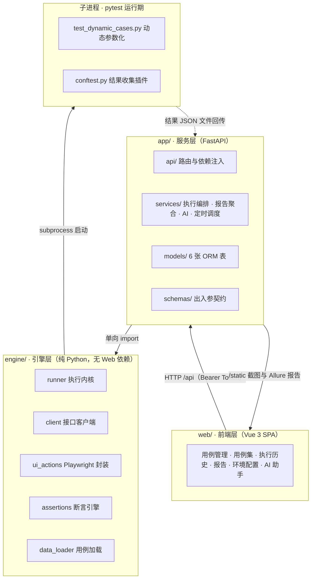
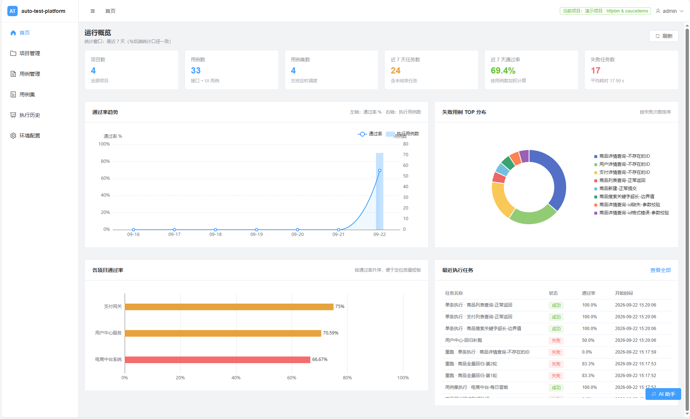
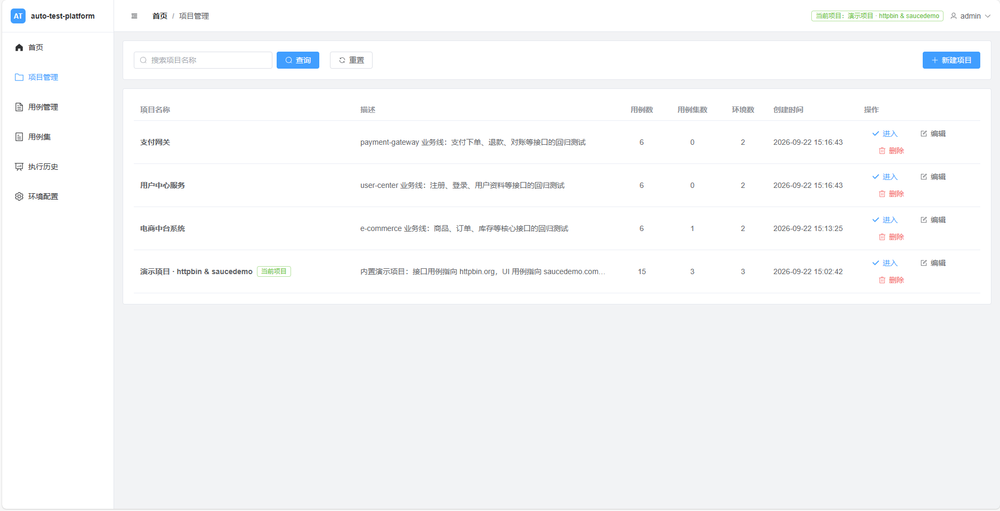
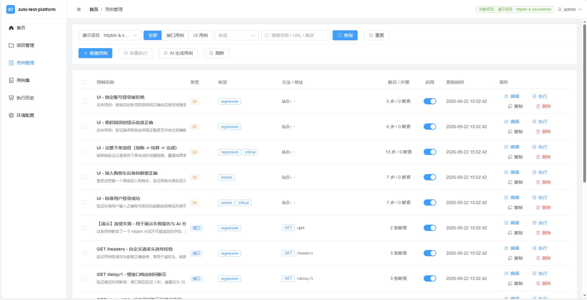
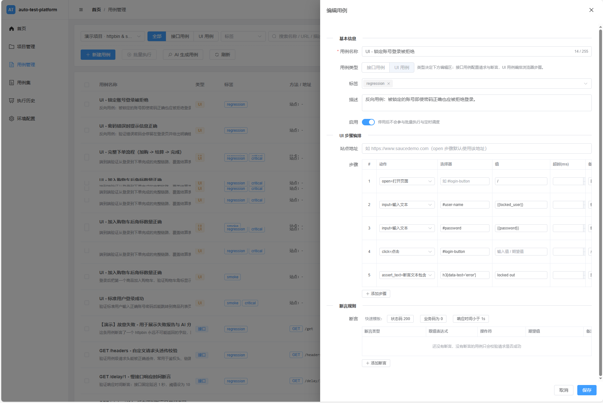
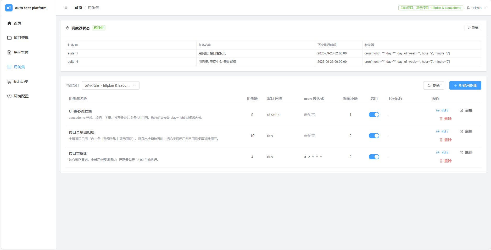
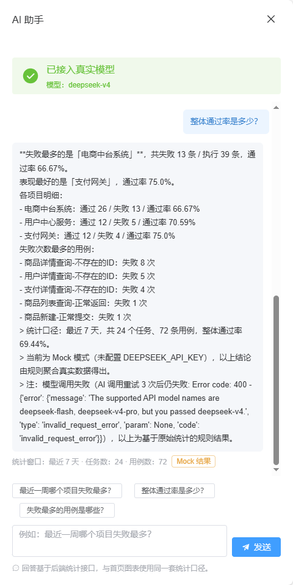

# auto-test-platform

[](LICENSE)


[](https://github.com/fyb580231/auto-test-platform/actions/workflows/ci.yml)

> 一个把接口测试、UI 测试与 AI 辅助串成闭环的自动化测试管理平台。
> 用例是数据而不是代码，执行交给独立的 pytest 子进程，失败归因交给大模型——不用改一行 Python 就能加用例。

---

## 目录

- [项目背景](#项目背景)
- [核心特性](#核心特性)
- [适用场景](#适用场景)
- [系统架构](#系统架构)
- [技术栈](#技术栈)
- [快速开始](#快速开始)
- [5 分钟上手教程](#5-分钟上手教程)
- [常用功能说明](#常用功能说明)
- [项目目录结构](#项目目录结构)
- [常见问题（FAQ）](#常见问题faq)
- [路线图（Roadmap）](#路线图roadmap)
- [License](#license)

---

## 项目背景

自动化测试本身不难写，难的是让它**长期活下去**。团队里常见的三个断点：

**一、用例维护成本高。** 接口用例通常直接写在 Python 代码里，加一条用例要走「改代码 → 提 PR → 合并 → 等 CI」的完整流程。结果是只有会写代码的人能加用例，业务和产品同学即便最清楚校验规则，也只能提需求排队。用例数量一多，脚本就会散落在各个仓库，没有统一的检索和复用入口。

**二、执行与平台过度耦合。** 很多自研测试平台的执行逻辑和 Web 服务长在同一进程里：想本地调试一条用例，得先起服务、连数据库、配环境变量；想接进 CI，又发现整套依赖太重跑不起来。测试脚本本来应该是最容易被复用的资产，反而被平台锁死了。

**三、失败结果难以追溯。** 报告通常只告诉你「断言失败」，至于是接口真的改坏了、还是用例自己写错了、还是环境挂了，得人工翻日志。历史执行记录往往只留一个数字，用例改名、环境删除之后，过去的报告就对不上号了。

这个项目针对这三点给出的是**数据驱动的用例模型 + 分层解耦的执行引擎 + AI 辅助归因**：用例以 YAML 或表单形式存在（不是代码），执行引擎不含任何 Web 依赖因而可以被任意 CI 复用，失败用例的请求/响应/断言明细会被结构化成可追溯的记录并交给大模型做归因。

---

## 核心特性

- [x] **接口测试** —— 支持 GET/POST/PUT/DELETE 等方法，可配置 headers / query / JSON body / form 表单；内置 5 类断言与 13 种比较操作符，支持 JSON Schema 结构校验与简化 JSONPath 取值
- [x] **UI 测试** —— 基于 Playwright 同步 API，支持 open / click / input / select / hover / press / wait 等 12 种动作；步骤失败自动截图留痕
- [x] **AI 辅助** —— 接入 DeepSeek：自然语言生成接口用例、失败根因归因、基于统计数据的报告问答；未配置 Key 时自动降级为规则兜底，功能不中断
- [x] **定时任务** —— 用例集可绑定标准 5 段 cron 表达式，由 APScheduler 后台调度；任务记录与手工执行走同一条链路
- [x] **Allure 报告** —— 自动生成 Allure HTML 报告并在平台内直接打开；UI 失败截图与执行日志可在线查看
- [x] **多环境** —— 一个项目下可配置多套环境（基地址、公共请求头、全局变量、超时、SSL 校验），支持指定默认环境
- [x] **用例编排** —— 支持前置用例（先登录再取数）与响应变量提取，用 `{{变量}}` 在后续请求中引用
- [x] **执行控制** —— 任务级并发上限、单任务超时强杀、失败自动重跑、整任务一键重跑
- [x] **零代码加用例** —— 用例以数据形式存储，新增用例不需要改动任何 Python 文件
- [x] **引擎层可独立运行** —— `engine/` 不含 Web 依赖，可用 `run_engine.py` 直接在任意 CI 中执行 YAML 用例

---

## 适用场景

**适合：**

- 团队有较多 HTTP 接口需要做回归验证，且希望业务/测试同学能自助维护用例，而不是每条都找开发
- 需要把接口测试与 UI 走查放在同一处管理，共用项目、环境、报告与执行历史
- 已有 pytest 脚本，想找一个能托管用例、留存历史报告、并做失败归因的轻量平台
- 希望测试执行能同时支持两种姿势：在平台上点按钮跑，以及在 CI 里通过命令行跑
- 中小团队或单人项目，希望开箱即用（默认 SQLite，无需额外部署数据库）

**不建议：**

- **需要复杂业务逻辑编排的场景**。用例是数据不是代码，写不了任意 Python 逻辑；复杂的条件分支、循环、自定义加密签名这类需求，直接写 pytest 脚本更合适
- **大规模并发压测**。这是功能测试平台，不是性能测试工具；虽然依赖里预留了 locust，但目前没有性能测试模块
- **需要严格权限隔离的多租户场景**。当前所有业务接口只要求登录，角色（admin/member）已建模但尚未接入路由级鉴权
- **需要与现有测试管理系统深度集成**。目前只有 REST API，没有提供 Webhook、插件机制或第三方系统的同步适配层
- **想要一个成熟的商业级平台**。这是一个功能完整但仍在演进的开源项目，容器化、数据库迁移等能力见下方 Roadmap

---

## 系统架构



三个关键设计点：

1. **依赖方向单向向下**：`web → app → engine`。`engine/` 不 import `app/` 的任何模块，因此它可以脱离 Web 服务独立运行（`python run_engine.py --file xxx.yaml`）。
2. **用例是数据**：平台把用例序列化成 JSON 载荷交给 pytest，用 `pytest.mark.parametrize` 动态展开成 N 条独立测试项，新增用例零代码改动。
3. **执行在子进程**：每次任务启动一个独立 pytest 子进程，服务进程不承担被测逻辑的崩溃风险，且超时能够真正强杀。

更详细的分层设计、数据模型与执行时序见 [ARCHITECTURE.md](ARCHITECTURE.md)。

---

## 界面预览

> 以下截图基于演示数据：3 个业务线项目、18 条接口用例、24 次执行记录。

**运行概览首页**：通过率趋势、失败用例分布、各项目质量一目了然



**多项目管理**：按业务线隔离用例与环境



**用例管理**：接口用例与 UI 用例统一管理，支持标签分类



**用例编辑器**：可视化编排 UI 步骤与接口断言规则



**用例集与定时任务**：cron 调度自动回归



**AI 智能助手**：自然语言查询测试报告，失败根因分析



---

## 技术栈

**后端**

| 组件 | 选型 |
| --- | --- |
| Web 框架 | FastAPI 0.115 + Uvicorn |
| ORM / 校验 | SQLAlchemy 2.0 · Pydantic 2.10 · pydantic-settings |
| 数据库 | SQLite（默认，开箱即用）／ MySQL（PyMySQL，改一个配置项切换） |
| 认证 | python-jose（JWT / HS256）+ bcrypt |
| 调度 | APScheduler 3.11 |
| 日志 | loguru（按天切割、彩色控制台） |

**测试引擎**

| 组件 | 选型 |
| --- | --- |
| 用例执行 | pytest 8.3 + pytest-asyncio |
| 失败重跑 | pytest-rerunfailures |
| HTTP 客户端 | httpx |
| UI 自动化 | Playwright 1.49（同步 API） |
| 结构校验 | jsonschema |
| 用例解析 | PyYAML |
| 报告 | allure-pytest |

**AI**

| 组件 | 选型 |
| --- | --- |
| 模型服务 | DeepSeek（`deepseek-chat`） |
| 调用方式 | OpenAI 官方 SDK 1.59 指向 DeepSeek 的 OpenAI 兼容端点 |

**前端**

| 组件 | 选型 |
| --- | --- |
| 框架 | Vue 3.5 + TypeScript 5.7 |
| 构建 | Vite 6 |
| UI 组件 | Element Plus |
| 状态管理 | Pinia |
| 路由 | Vue Router 4 |
| 图表 | ECharts |
| 请求 | axios（统一拦截器处理鉴权与错误） |

**工程化**

ruff（lint）· black（格式化）· pre-commit · GitHub Actions · Docker / Docker Compose

---

## 快速开始

### 环境要求

| 场景 | 依赖 |
| --- | --- |
| Docker 方式 | Docker 20.10+ 与 Docker Compose v2 |
| 本地方式 | Python **3.11+**（推荐 3.12）、Node **18.18+**（推荐 20 LTS）、pnpm **9** |
| 可选 | Java 8+ 与 Allure CLI（仅本地方式需要生成 Allure HTML 报告时） |

### 方式一：Docker Compose 一键启动（推荐）

无需在本机安装 Python 与 Node，两条命令拉起全部服务：

```bash
git clone https://github.com/fyb580231/auto-test-platform.git
cd auto-test-platform

# 可选：按需覆盖配置（JWT 密钥、DeepSeek Key、端口等）
cp .env.example .env

docker compose up -d --build
```

启动完成后：

| 入口 | 地址 |
| --- | --- |
| 平台首页 | http://localhost:8080 |
| 后端接口文档 | http://localhost:8000/docs |
| 健康检查 | http://localhost:8000/api/health |

浏览器只需要访问 **8080** —— 前端容器里的 nginx 已经把 `/api` 与 `/static` 反向代理到后端，前后端同源，不存在跨域问题。

常用命令：

```bash
docker compose logs -f backend     # 跟踪后端日志
docker compose ps                  # 查看容器状态
docker compose down                # 停止并移除容器（数据保留在 ./data 与 ./reports）
docker compose down -v             # 连同匿名卷一起清理
```

**关于镜像构建参数**（在 `docker-compose.yml` 的 `build.args` 下调整）：

| 参数 | 默认 | 说明 |
| --- | --- | --- |
| `INSTALL_ALLURE` | `true` | 装入 Allure CLI 与 JRE，任务结束后可自动生成 HTML 报告 |
| `INSTALL_PLAYWRIGHT_BROWSERS` | `false` | 装入 Chromium 内核，**执行 UI 用例时必须打开**（镜像会增大约 300MB） |
| `PIP_INDEX_URL` | 空 | 国内网络可设为 `https://pypi.tuna.tsinghua.edu.cn/simple` 加速依赖安装 |

例如需要跑 UI 用例：

```bash
INSTALL_PLAYWRIGHT_BROWSERS=true docker compose up -d --build
```

> **数据持久化**：`./data`（SQLite 库与内置演示用例）和 `./reports`（日志、失败截图、Allure 报告）都以 volume 挂载，容器重建不会丢数据。

### 方式二：本地分别启动后端与前端

适合需要改代码、断点调试的场景。

**第 1 步：准备后端**

```bash
git clone https://github.com/fyb580231/auto-test-platform.git
cd auto-test-platform

# 创建并激活虚拟环境
python -m venv .venv
source .venv/bin/activate          # Windows: .venv\Scripts\activate

# 安装依赖
pip install -r requirements.txt

# 复制配置样板（.env 已被 .gitignore 忽略，不会进仓库）
cp .env.example .env
```

**第 2 步：启动后端**

```bash
uvicorn app.main:app --reload --host 0.0.0.0 --port 8000
```

首次启动会自动完成：建表 → 创建默认管理员 → 写入演示项目/环境/用例/用例集 → 启动定时调度器。

验证后端已就绪：

```bash
curl http://127.0.0.1:8000/api/health
```

**第 3 步：准备并启动前端**

另开一个终端：

```bash
cd web
pnpm install
pnpm dev
```

开发服务器默认监听 **5173**，并已把 `/api`、`/static` 代理到 `http://127.0.0.1:8000`，因此前端代码里不硬编码后端地址。

浏览器打开 http://localhost:5173 即可。

**第 4 步（可选）：命令行直接跑用例**

引擎层不依赖 Web 服务，可以直接跑用例文件：

```bash
# 跑一个 YAML 用例文件
python run_engine.py --file data/demo_api_cases.yaml

# 只跑 smoke 标签
python run_engine.py --file data/demo_api_cases.yaml --tags smoke

# 覆盖环境地址（不改动用例文件）
python run_engine.py --file data/demo_api_cases.yaml --var base_url=https://httpbin.org

# 查看全部参数
python run_engine.py --help
```

### 默认登录账号

| 用户名 | 密码 | 角色 |
| --- | --- | --- |
| `admin` | `admin123` | admin（首次启动自动创建） |

> **生产环境务必修改**：把 `.env` 里的 `DEFAULT_ADMIN_PASSWORD` 与 `JWT_SECRET` 换成随机长字符串，再重启服务。生成随机密钥：
> ```bash
> python -c "import secrets; print(secrets.token_urlsafe(48))"
> ```

---

## 5 分钟上手教程

下面用「给 httpbin.org 加一条连通性用例」走完整个流程。每一步同时给出 **界面操作** 与 **API 调用** 两种方式，任选其一。

### 第 1 步：创建项目

在平台里，项目是「用例 / 用例集 / 执行历史 / 环境配置」的统一上下文。

- **界面**：左侧菜单「项目管理」→「新建项目」，名称填 `demo-project`
- **API**：先登录拿 token，后续请求都带上它

```bash
# 登录（localhost:8000 是本地方式的后端；Docker 方式同样可用 8080 域名下的 /api）
TOKEN=$(curl -s -X POST http://localhost:8000/api/auth/login \
  -H 'Content-Type: application/json' \
  -d '{"username":"admin","password":"admin123"}' \
  | python -c "import sys, json; print(json.load(sys.stdin)['access_token'])")

# 创建项目
curl -s -X POST http://localhost:8000/api/projects \
  -H "Authorization: Bearer $TOKEN" \
  -H 'Content-Type: application/json' \
  -d '{"name": "demo-project", "description": "5 分钟上手示例"}'
```

### 第 2 步：配置环境

用例里的 `url` 通常写相对路径，实际地址由环境的 `base_url` 拼出来，这样换环境不用改用例。

- **界面**：左侧菜单「环境配置」→「新建环境」
- **API**（假设上一步创建的项目 ID 是 `1`）：

```bash
curl -s -X POST http://localhost:8000/api/projects/1/environments \
  -H "Authorization: Bearer $TOKEN" \
  -H 'Content-Type: application/json' \
  -d '{
        "name": "dev",
        "base_url": "https://httpbin.org",
        "is_default": true,
        "timeout": 15
      }'
```

### 第 3 步：添加第一个接口用例

- **界面**：左侧菜单「用例管理」→「新建用例」，按表单填入方法、路径、断言
- **API**：

```bash
curl -s -X POST http://localhost:8000/api/projects/1/testcases \
  -H "Authorization: Bearer $TOKEN" \
  -H 'Content-Type: application/json' \
  -d '{
        "name": "GET /get 连通性检查",
        "case_type": "api",
        "description": "验证服务可访问，且 Query 参数能被正确回显",
        "tags": ["smoke"],
        "method": "GET",
        "url": "/get",
        "params": {"source": "tutorial", "page": 1},
        "assertions": [
          {"type": "status_code", "expected": 200, "name": "状态码 200"},
          {"type": "json_field", "field": "$.args.source", "op": "eq",
           "expected": "tutorial", "message": "Query 参数 source 未被服务端接收"},
          {"type": "response_time", "expected": 10000, "name": "响应时间小于 10s"}
        ]
      }'
```

### 第 4 步：执行用例

执行是**异步**的：接口立刻返回一条任务记录，真正的执行在后台子进程里进行。

- **界面**：在用例列表勾选该用例 →「批量执行」；或点该行的「执行」
- **API**（假设用例 ID 是 `1`）：

```bash
# 单条执行；也可用 POST /api/testcases/batch-run 传 {"case_ids": [1, 2]}
curl -s -X POST http://localhost:8000/api/testcases/1/run \
  -H "Authorization: Bearer $TOKEN"
```

响应里的 `id` 就是任务 ID，用它查询结果：

```bash
curl -s http://localhost:8000/api/tasks/1 -H "Authorization: Bearer $TOKEN"
```

任务状态流转为 `pending → running → success / failed / error`。

### 第 5 步：查看报告

- **界面**：左侧菜单「执行历史」→ 点进任务详情，可以看到每条用例的**请求、响应、断言明细、耗时、重跑次数**；失败用例可直接触发 AI 归因分析；如果生成了 Allure 报告，详情页会给出「查看 Allure 报告」入口，指向 `/static/allure/<task_no>/index.html`
- **API**：

```bash
# 任务详情（含每条用例结果）
curl -s http://localhost:8000/api/tasks/1 -H "Authorization: Bearer $TOKEN"

# 执行日志（stdout 尾部，单次最多 200000 字符，超出会置 truncated 标记）
curl -s http://localhost:8000/api/tasks/1/log -H "Authorization: Bearer $TOKEN"

# 首页统计：通过率趋势、项目分布、失败用例 TOP N
curl -s "http://localhost:8000/api/dashboard/stats?days=7" -H "Authorization: Bearer $TOKEN"
```

> **试试失败长什么样**：内置演示用例 `api_010` 会断言一个响应里不存在的字段 `$.business_code`，**它必然失败**。这不是 bug，而是特意留的失败样本，方便你直接体验失败报告、UI 截图与 AI 失败归因。演示完删掉即可。

---

## 常用功能说明

### 如何写一个接口用例

**界面上**：用例管理 → 新建用例，选择类型 `api`，填写方法、路径、参数与断言即可。

**以文件形式**（适合纳入代码仓库、走 CI）：用例文件顶层是 `variables` + `cases`：

```yaml
variables:                      # 文件级变量，可在用例内用 {{变量名}} 引用
  base_url: https://httpbin.org
  test_username: test_user_001

cases:
  - id: api_001
    name: "GET /get - 连通性与 Query 参数回显"
    case_type: api
    description: "这条用例在做什么"
    tags: ["smoke", "critical"]          # 可多选，用于筛选执行
    method: GET
    url: /get                            # 相对路径，与 environment.base_url 拼接
    headers:
      X-Trace-Id: "{{trace_id}}"
    params:
      source: auto_test_platform
      page: 1
    assertions:
      - type: status_code
        expected: 200
        name: "状态码 200"
      - type: json_field
        field: "$.args.source"
        op: eq
        expected: auto_test_platform
        message: "Query 参数 source 未被服务端正确接收"
```

**用例字段说明**：

| 字段 | 说明 |
| --- | --- |
| `name` / `description` | 用例名称与说明 |
| `case_type` | `api` 或 `ui` |
| `tags` | 标签列表，执行时可按标签筛选（自动转小写去重） |
| `method` / `url` | 请求方法与地址（`url` 支持相对路径） |
| `headers` / `params` / `body` / `form` | 请求头、Query 参数、JSON 体、表单体（`body` 与 `form` 二选一） |
| `extract` | 从响应中提取变量供后续引用，格式 `[{name, path}]`，如 `{"name": "token", "path": "$.data.token"}` |
| `setup_case_id` | 前置用例 ID（平台模式），典型用法是先执行登录用例拿到 token |
| `assertions` | 断言规则列表 |
| `enabled` | 是否启用，停用的用例会被执行编排跳过 |

**变量渲染**：`{{变量}}` 占位符可用于 url、headers、params、body、断言期望值以及 UI 步骤的 selector / value。变量优先级为：**命令行 `--var` 覆盖 > 用例内定义 > 文件级 `variables` > 环境配置**。变量名中含 `token` / `secret` / `password` / `key` 时，日志会自动打码。

**支持的断言类型：**

| 类型 | 作用 | 关键字段 |
| --- | --- | --- |
| `status_code` | 校验 HTTP 状态码 | `expected` |
| `json_field` | 按简化 JSONPath 取值后比较 | `field`（如 `$.data.items[0].id`）、`op`、`expected` |
| `response_time` | 校验响应耗时不超过给定毫秒数 | `expected`（毫秒） |
| `schema` | 用 JSON Schema 校验响应结构 | `expected`（Schema 对象） |
| `header` | 校验响应头 | `field`、`op`、`expected` |

**支持的操作符**：`eq` · `ne` · `contains` · `not_contains` · `gt` · `lt` · `ge` · `le` · `empty` · `not_empty` · `in` · `regex` · `length_eq`

> 所有断言会**全部执行完再统一汇总**失败明细，而不是遇到第一个失败就中断 —— 一次执行就能看全所有问题。
> 若一条用例没有配置任何断言，会兜底断言 `status_code == 200`，避免出现「跑了但没校验」的假绿灯。

### 如何写一个 UI 用例

UI 用例把 `method` / `url` 换成 `base_url` + `steps`：

```yaml
  - id: ui_001
    name: "登录成功并进入商品列表"
    case_type: ui
    tags: ["smoke"]
    base_url: https://www.saucedemo.com
    steps:
      - action: open
        url: /
      - action: input
        selector: "#user-name"
        value: "{{test_username}}"
      - action: input
        selector: "#password"
        value: "{{test_password}}"
      - action: click
        selector: "#login-button"
      - action: assert_url
        expected_contains: inventory
      - action: screenshot
        name: "登录后首页"
    assertions:
      - type: status_code
        expected: 200
```

**支持的 12 种动作**：`open` · `click` · `input` · `select` · `hover` · `press` · `wait` · `assert_visible` · `assert_text` · `assert_value` · `assert_url` · `screenshot`

每个步骤可配 `selector`、`value`、`timeout`（默认 15000ms）与 `name`。

**失败自动截图**：任一步骤失败都会立即截图并中断该用例，截图保存到 `reports/screenshots/<task_id>/`，文件名形如 `<用例名>_step<序号>_failed.png`，平台会把它转成 `/static/screenshots/...` 的 URL 展示在任务详情里。

> **前提**：执行 UI 用例需要安装 Playwright 浏览器内核：
> - 本地方式：`playwright install chromium`
> - Docker 方式：构建时打开 `INSTALL_PLAYWRIGHT_BROWSERS=true`

### 如何配置环境变量

全部配置收敛在 [app/config.py](app/config.py) 一个模块，其余代码一律 `from app.config import settings`，因此环境变量的来源与默认值只有一处。

**配置方式**：

- **本地方式**：`cp .env.example .env`，编辑 `.env`（已被 `.gitignore` 忽略）
- **Docker 方式**：在同目录放 `.env`，`docker-compose.yml` 会自动读取并覆盖其中的默认值

**常用配置项**：

| 分类 | 变量 | 默认值 | 说明 |
| --- | --- | --- | --- |
| 应用 | `HOST` / `PORT` | `0.0.0.0` / `8000` | 监听地址与端口 |
| | `DEBUG` | `false` | 开启后 500 响应会带真实错误信息，生产环境请保持关闭 |
| | `CORS_ORIGINS` | `http://localhost:5173,http://localhost:8080` | 逗号分隔的跨域白名单 |
| 数据库 | `DB_TYPE` | `sqlite` | 可选 `sqlite` 或 `mysql` |
| | `SQLITE_PATH` | `./data/auto_test_platform.db` | SQLite 文件路径（相对路径按项目根解析） |
| | `MYSQL_HOST` / `MYSQL_PORT` / `MYSQL_USER` / `MYSQL_PASSWORD` / `MYSQL_DATABASE` | `127.0.0.1` / `3306` / `root` / 空 / `auto_test_platform` | 切换 MySQL 时填写 |
| 认证 | `JWT_SECRET` | `dev-only-secret-please-change` | **生产必须替换** |
| | `JWT_EXPIRE_MINUTES` | `1440` | 令牌有效期（分钟） |
| 管理员 | `DEFAULT_ADMIN_USERNAME` / `DEFAULT_ADMIN_PASSWORD` | `admin` / `admin123` | 首次启动自动创建 |
| AI | `DEEPSEEK_API_KEY` | 空 | 留空则自动降级为 Mock |
| | `DEEPSEEK_MODEL` | `deepseek-chat` | DeepSeek 官方模型名，另有 `deepseek-reasoner` |
| | `AI_ENABLED` / `AI_MOCK` | `true` / `false` | 总开关与强制 Mock 开关 |
| | `AI_TIMEOUT_SECONDS` / `AI_MAX_RETRIES` / `AI_MAX_TOKENS` | `30` / `2` / `4096` | 超时、重试次数与单次生成上限 |
| | `AI_MAX_LOG_CHARS` | `6000` | 失败分析送入模型的最大日志字符数（成本控制） |
| 执行引擎 | `PYTEST_TIMEOUT_SECONDS` | `300` | 单任务执行超时，超时会被强制终止并记为 error |
| | `MAX_CONCURRENT_TASKS` | `4` | 同时执行的任务数上限 |
| | `DEFAULT_RETRY_TIMES` | `2` | 用例默认失败重跑次数 |
| | `ALLURE_AUTO_GENERATE` / `ALLURE_COMMAND` | `true` / `allure` | 是否自动生成 Allure HTML 及命令名 |
| 日志 | `LOG_LEVEL` / `LOG_DIR` / `LOG_RETENTION_DAYS` | `INFO` / `./reports/logs` / `14` | 日志级别、目录与保留天数 |

> **改完配置要重启服务**：配置通过 `lru_cache` 单例在进程启动时读取一次，修改 `.env` 后需要重启进程才会生效。

### 如何定时执行测试集

1. **准备用例集**：「用例集」页面新建，勾选要包含的用例，并选择默认执行环境；
2. **填写 cron 表达式**：必须是**标准 5 段格式**（分 时 日 月 周），例如：

   | 表达式 | 含义 |
   | --- | --- |
   | `0 2 * * *` | 每天 02:00 |
   | `30 9 * * 1-5` | 工作日 09:30 |
   | `0 */6 * * *` | 每 6 小时 |
   | `0 8 1 * *` | 每月 1 日 08:00 |

   表达式段数不是 5 段会在保存时直接报错，避免非法表达式污染调度器。

3. **启用**：用例集的 `enabled` 开关打开后，调度器会自动注册任务；关闭或清空 cron 则注销。

**调度行为**：

- 调度器与应用生命周期绑定，服务启动时从数据库**全量重建**任务列表（数据库是唯一事实来源，不额外维护持久化 jobstore）
- 定时触发创建的任务与手工执行**走完全相同的链路**，任务列表里通过触发类型区分
- 时区固定为 `Asia/Shanghai`；任务配置了 `coalesce`（错过多次只补跑一次）与 `max_instances=1`（同一用例集不并发）
- 查看当前已注册的全部定时任务：`GET /api/scheduler/jobs`

### AI 功能怎么用

AI 能力由 DeepSeek 提供，三项功能：

| 功能 | 入口 | 说明 |
| --- | --- | --- |
| 生成用例 | `POST /api/ai/generate-cases` | 用自然语言描述接口，生成可直接执行的结构化用例 |
| 失败归因 | `POST /api/ai/analyze-failure` | 分析失败用例的请求/响应/断言/堆栈，输出分类结论与修复建议 |
| 报告问答 | `POST /api/ai/query-report` | 基于真实统计数据回答「本周通过率为什么下降」这类问题 |

**启用步骤**：

1. 到 [platform.deepseek.com](https://platform.deepseek.com) 申请 API Key；
2. 写入配置：

   ```dotenv
   # .env
   DEEPSEEK_API_KEY=sk-xxxxxxxxxxxxxxxx
   DEEPSEEK_MODEL=deepseek-chat
   ```

   Docker 方式也可以直接编辑同目录的 `.env`，`docker-compose.yml` 会自动读取。

3. **重启服务**（配置在进程启动时读取一次）；
4. 验证是否生效：

   ```bash
   curl -s http://localhost:8000/api/ai/status -H "Authorization: Bearer $TOKEN"
   ```

**降级行为（重点）**：以下任意一种情况都会自动降级为「Mock 模式」——`AI_ENABLED=false`、`AI_MOCK=true`、`DEEPSEEK_API_KEY` 为空，**以及调用过程中发生任何异常**。降级后不会返回「AI 不可用」，而是返回**基于真实数据的规则结果**（模板生成用例、关键词归因、真实统计聚合），响应里带 `mocked=true` 标记。因此没有 Key 也能完整演示所有功能，模型服务抖动也不会影响平台主流程。

**成本控制**：送入模型的失败日志会按 `AI_MAX_LOG_CHARS` 分段截断（堆栈保留最多，因为定位信息密度最高）；重试采用指数退避（上限 4 秒）；每次调用的 token 用量会记录到日志。

---

## 项目目录结构

```
auto-test-platform/
├── app/                            # 服务层：FastAPI 应用
│   ├── api/                        # 路由层：只做参数声明与依赖注入
│   │   ├── auth.py                 #   注册 / 登录 / 当前用户 / 改密
│   │   ├── projects.py             #   项目 CRUD
│   │   ├── environments.py         #   环境配置 CRUD
│   │   ├── testcases.py            #   用例 CRUD / 导入 / 单条与批量执行
│   │   ├── testsuites.py           #   用例集 CRUD / 执行 / 定时任务查询
│   │   ├── tasks.py                #   执行历史 / 详情 / 日志 / 重跑
│   │   ├── dashboard.py            #   首页统计 / 健康检查
│   │   └── ai.py                   #   AI 三项能力的 HTTP 入口
│   ├── models/                     # ORM 模型（6 张表）
│   ├── schemas/                    # Pydantic 出入参契约（前端类型与之对齐）
│   ├── services/                   # 业务逻辑
│   │   ├── test_runner.py          #   执行编排：任务级并发 + pytest 子进程 + 结果落库
│   │   ├── report_service.py       #   统计聚合与报告数据
│   │   ├── ai_service.py           #   DeepSeek 调用与规则降级
│   │   ├── scheduler.py            #   APScheduler 定时调度
│   │   ├── seed.py                 #   首次启动的演示数据初始化
│   │   └── prompts/                #   三个提示词模板
│   ├── utils/                      # JWT、bcrypt、loguru 日志封装
│   ├── config.py                   # 全局配置唯一入口
│   ├── database.py                 # 引擎与会话管理
│   ├── deps.py                     # 依赖注入：会话 / 当前用户 / 分页
│   └── main.py                     # 应用装配（中间件、异常处理、静态资源、路由）
│
├── engine/                         # 引擎层：纯 Python，无 Web 依赖
│   ├── runner.py                   #   用例执行内核 + PytestRunner（子进程编排）
│   ├── client.py                   #   httpx 接口客户端（变量渲染、敏感头脱敏）
│   ├── ui_actions.py               #   Playwright 同步 API 封装（12 种动作）
│   ├── assertions.py               #   5 类断言 + 13 种操作符
│   ├── data_loader.py              #   YAML / JSON 用例加载与筛选
│   └── allure_helper.py            #   Allure 可选依赖（不可用时全部 no-op）
│
├── testcases/                      # pytest 运行期入口
│   ├── conftest.py                 #   结果收集插件（引擎层与服务层的唯一契约点）
│   └── test_dynamic_cases.py       #   把平台下发的用例参数化成 N 条测试项
│
├── web/                            # 前端：Vue 3 + TypeScript
│   ├── src/
│   │   ├── api/                    #   按模块拆分的接口封装与 axios 实例
│   │   ├── components/             #   用例编辑器、用例集编辑器、报告查看器、AI 助手
│   │   ├── router/                 #   路由表与登录守卫
│   │   ├── stores/                 #   Pinia：用户信息、当前项目
│   │   ├── types/                  #   与后端 schemas 对齐的类型定义
│   │   ├── utils/                  #   格式化工具
│   │   └── views/                  #   页面：登录 / 首页 / 项目 / 用例 / 用例集 / 任务 / 环境
│   ├── nginx.conf                  #   生产部署：SPA 回退 + 反向代理
│   └── Dockerfile                  #   多阶段构建（Node 构建 → nginx 托管）
│
├── data/                           # 内置演示用例（指向 httpbin / saucedemo）
│   ├── demo_api_cases.yaml
│   └── demo_ui_cases.yaml
│
├── reports/                        # 运行期产物（不入库）
│   ├── generated/                  #   执行载荷与结果 JSON，按 task_no 分文件
│   ├── logs/                       #   按天切割的执行日志
│   ├── screenshots/                #   UI 失败截图，按 task_id 分目录
│   ├── allure-results/             #   Allure 原始结果，按 task_no 分目录
│   └── allure-report/              #   Allure HTML 报告，按 task_no 分目录
│
├── .github/workflows/ci.yml        # CI：lint / 启动冒烟 / 前端构建 / 镜像构建
├── Dockerfile                      # 后端镜像
├── docker-compose.yml              # 一键启动编排
├── run_engine.py                   # 引擎层独立命令行入口
├── pyproject.toml                  # ruff / black / pytest 配置
├── requirements.txt                # 后端与引擎依赖
├── .env.example                    # 环境变量样板
├── .pre-commit-config.yaml         # 提交前钩子
├── README.md
└── ARCHITECTURE.md
```

---

## 常见问题（FAQ）

### 启动失败 / 依赖装不上怎么办？

**端口被占用**（`Address already in use` / `errno 10048`）

默认占用 `8000`（后端）、`5173`（前端开发服务器）、`8080`（Docker 前端）。三种处理方式：

```bash
# 1) 换个端口启动
uvicorn app.main:app --port 8001
pnpm dev --port 5174

# 2) Docker 方式：在 .env 里改映射端口
BACKEND_PORT=8001
WEB_PORT=8081
# 改完后 docker compose up -d（无需重新 build）

# 3) 查是谁占用了端口再决定是否结束它
# Windows
netstat -ano | findstr :8000
# macOS / Linux
lsof -i :8000
```

注意：换后端端口后，前端的代理目标也要同步改 —— 本地开发改 [web/vite.config.ts](web/vite.config.ts) 里的 `BACKEND_ORIGIN`；Docker 方式改 `docker-compose.yml` 的端口映射，`nginx.conf` 里的上游是容器名 `backend:8000`，不需要动。

**pytest 等 Python 依赖装不上**

- **版本不匹配**：项目要求 Python 3.11+。先确认 `python --version`，低于 3.11 请升级
- **网络超时**：换国内镜像源

  ```bash
  pip install -r requirements.txt -i https://pypi.tuna.tsinghua.edu.cn/simple
  ```

  Docker 方式：设置环境变量 `PIP_INDEX_URL=https://pypi.tuna.tsinghua.edu.cn/simple` 再 `docker compose up -d --build`
- **需要编译工具**：少数包在无预编译 wheel 的平台（如某些 Alpine、ARM 环境）需要 gcc。优先使用「本地方式」（官方 CPython）或 Docker 方式（`python:3.12-slim` 有完整 wheel 覆盖）
- **`playwright` 相关报错**：`pip install playwright` 只装 Python 包，浏览器内核要单独装一次 —— `playwright install chromium`。不跑 UI 用例则不需要

**数据库初始化失败**

- 报权限错误或无法写入：确认项目根目录下的 `data/` 目录存在且当前用户可写（SQLite 相对路径按**项目根目录**解析，而不是启动命令所在的目录）
- Docker 方式：`./data` 会被挂载进容器，确认宿主机该目录权限正常
- 想重置数据：停掉服务，删除 `data/auto_test_platform.db`（连带 `-wal`、`-shm` 文件），重启后会自动重新建表并写入演示数据
- 切到 MySQL 时连不上：确认 `DB_TYPE=mysql` 与 `MYSQL_*` 五项都已填写，且目标库已提前创建（平台只建表，不建库）

### 用例执行失败怎么排查？

**先看任务状态，它区分的含义不同：**

| 状态 | 含义 |
| --- | --- |
| `failed` | 用例跑完了，但断言没通过（**正常的测试结果**） |
| `error` | 执行过程本身出问题：超时被强杀、用例无法运行、结果文件缺失 |
| `success` | 全部用例通过 |

**排查顺序**：

1. **打开任务详情**，看每条用例的「请求 / 响应 / 断言」明细——这比看日志快得多。平台会记录实际发出的 URL、状态码、响应体，以及每条断言的期望值与实际值。
2. **看断言为什么失败**。最常见的是期望值类型不匹配（Query 参数回显回来是字符串 `"1"` 而不是数字 `1`）。平台对这类情况做了宽松比较，但如果仍然失败，用 `schema` 断言做结构校验、或在期望值上对齐类型。
3. **看执行日志**：任务详情里的「执行日志」，或 `GET /api/tasks/{id}/log`。日志里包含 pytest 的原始输出。
4. **本地复现**：把出问题的用例导出为 YAML，用引擎层直接跑，避开 Web 层干扰：

   ```bash
   python run_engine.py --file your_cases.yaml --tags smoke
   ```
5. **让 AI 给个初判**：任务详情里对失败用例点「AI 分析」，它会结合请求/响应/断言/堆栈输出「接口缺陷 / 脚本缺陷 / 环境问题 / 用例设计问题」的分类结论。注意这是辅助判断，仍需人工确认。
6. **`error` 状态的额外检查点**：确认目标环境可达（比如演示用例依赖 httpbin.org 与 saucedemo.com，境外网络不通会直接失败）；跑 UI 用例时确认已 `playwright install chromium`；确认单个任务没超过 `PYTEST_TIMEOUT_SECONDS`（默认 300 秒）。

### Allure 报告打不开怎么办？

Allure HTML 报告由 **Allure CLI** 生成，而它依赖 **Java**，这是最容易踩的坑。平台生成报告失败时**只记日志、不会让任务变红**，所以任务成功 ≠ 报告已生成。

**先判断报告到底生成了没有**：任务详情里有「查看 Allure 报告」入口说明已生成，地址形如：

```
http://localhost:8000/static/allure/<task_no>/index.html
```

如果入口没有出现，或访问返回 404，说明生成环节失败了。按下面排查：

**1. 检查 Allure CLI 是否可用**

```bash
allure --version        # 应输出版本号，如 2.46.1
java -version           # Allure 依赖 JRE，未安装会报错
```

本地方式没装的话：

```bash
# macOS
brew install allure
# 或从官方 Release 手动下载解压后加入 PATH
# https://github.com/allure-framework/allure2/releases
```

**2. Docker 方式**：后端镜像默认已内置（`INSTALL_ALLURE=true`）。如果之前用 `--build-arg INSTALL_ALLURE=false` 构建过，重新构建即可：

```bash
docker compose build --no-cache backend && docker compose up -d
```

**3. 不想装 Allure**：把 `ALLURE_AUTO_GENERATE` 设为 `false`，平台就不再去调用 CLI，也不会产生失败日志。

**4. 想直接看原始结果**：Allure 原始数据始终保存在 `reports/allure-results/<task_no>/`，可以在本机用一条命令起个临时服务查看：

```bash
allure serve reports/allure-results/<task_no>
```

**5. 报告为空 / 用例全部缺失**：确认执行时确实产生了结果文件——检查 `reports/allure-results/<task_no>/` 下是否有 `*-result.json`。若为空而任务显示成功，通常是用例集本身为空（pytest 未收集到用例，退出码 5 也被判定为成功）。

> 顺带一提：每次执行都是**独立的报告目录**，按 `task_no` 区分，所以历史报告不会被覆盖。

### DeepSeek Key 配置后不生效

按下面五点依次排查：

1. **是否重启了服务（最常见原因）**。配置通过 `lru_cache` 单例在进程启动时读取一次，改完 `.env` 必须重启：本地方式重启 `uvicorn`，Docker 方式执行 `docker compose restart backend`（改了 `environment` 或 `.env` 中的值时需要 `docker compose up -d` 让容器重建）。
2. **确认 Key 真的被读到了**：

   ```bash
   curl -s http://localhost:8000/api/ai/status -H "Authorization: Bearer $TOKEN"
   ```

   返回里的 `ai_available` 为 `false` 就说明没读到。该字段为 `true` 的**三个必要条件**是：`AI_ENABLED=true`、`AI_MOCK=false`、`DEEPSEEK_API_KEY` 非空白。
3. **环境变量名与位置是否写对**。本地方式写在项目根目录的 `.env`（注意不是 `web/.env`，也不是 `.env.example`）；Docker 方式写在**与 `docker-compose.yml` 同级**的 `.env`，变量名都是 `DEEPSEEK_API_KEY`。
4. **模型名是否有效**。默认 `DEEPSEEK_MODEL=deepseek-chat`，这是 DeepSeek 官方兼容 OpenAI 接口的模型名。若写成不存在的模型名，DeepSeek 会返回 400，平台随即降级为 Mock 并把原因写进响应体的 `raw` 字段。
5. **看响应里的降级标记**。即使 Key 配好了，只要调用过程抛异常，平台也会**自动降级**为规则兜底，并且响应里会带 `mocked=true` 与 `raw` 字段——`raw` 里记录了具体的失败原因（如认证失败、超时、余额不足）。先看 `raw` 再定位。

> 没配 Key 不影响使用：三项 AI 功能都会返回基于真实数据的规则结果，只是响应带 `mocked=true` 标记。

### 如何新增一个自定义断言类型

以新增一个「校验响应体文本包含某关键字」的断言类型 `body_contains` 为例，需要改**两处**（断言实现与 schema 字面量必须保持同步）：

**第 1 步：在引擎层实现断言**

打开 [engine/assertions.py](engine/assertions.py)，参照现有的断言类型做三件事：

1. 在文件顶部的 `ASSERT_TYPE_*` 常量区（约 21-25 行）新增常量：

   ```python
   ASSERT_TYPE_BODY_CONTAINS = "body_contains"
   ```

2. 新增一个 `_check_*` 方法，与 `_check_status`、`_check_json_field` 等保持同样的签名与返回类型：

   ```python
   @staticmethod
   def _check_body_contains(response: ApiResponse, rule: AssertionRule) -> AssertionResult:
       """校验响应文本是否包含期望关键字。"""
       expected = str(rule.expected or "")
       actual = response.text or ""
       passed = expected in actual
       return AssertionResult(
           name=rule.label,
           passed=passed,
           expected=expected,
           actual="<命中>" if passed else actual[:200],
           message=rule.message,
       )
   ```

3. 在 `AssertionEngine._check_one()` 的类型分派里加一个分支（与其他 `_check_*` 并列）：

   ```python
   if rule.type == ASSERT_TYPE_BODY_CONTAINS:
       return AssertionEngine._check_body_contains(response, rule)
   ```

**第 2 步：在 schema 里放开字面量**

打开 [app/schemas/common.py](app/schemas/common.py)，把新类型加进 `AssertType`（否则请求会被 Pydantic 拦在 422）：

```python
AssertType = Literal["status_code", "json_field", "response_time", "schema", "header", "body_contains"]
```

该文件顶部有注释说明它必须与 `engine.assertions` 中的常量保持一致，改完记得两边都同步。

**第 3 步（可选）：让前端表单也能选**

如果希望界面上能下拉选到它，在 [web/src/types/index.ts](web/src/types/index.ts) 的断言类型联合类型里补上同样的值。

**第 4 步：验证**

```bash
# 类型检查与流程回归
python -m pytest -q                    # 收集期应无异常
python run_engine.py --file your_cases.yaml    # 用真实用例跑一遍
```

> 同理，`engine/ui_actions.py` 里新增 UI 动作时，也要同步 [app/schemas/common.py](app/schemas/common.py) 中的 `UIAction` 字面量。

---

## 路线图（Roadmap）

按优先级排列，欢迎通过 Issue 讨论具体设计。

**近期（体验完善）**

- [ ] 补齐数据库版本化迁移（接入 Alembic，替代当前的 `create_all`）
- [ ] 打通路由级 RBAC：`UserRole` 与 `AdminUser` 依赖已就绪，只需在需要管理员权限的路由上替换依赖
- [ ] 前端类型由 OpenAPI 自动生成，替代当前手工与后端 `schemas` 对齐的方式
- [ ] 用例集支持「按标签动态选取用例」，避免每次新增用例都要手动勾选

**中期（能力扩展）**

- [ ] 任务内并行执行：`PYTEST_MAX_WORKERS` 配置项已预留，需要先把进程内遥测改造成可跨进程回传，再接入 pytest-xdist
- [ ] 执行结果回写通道：`TriggerType.CI` 已定义枚举值但尚无写入入口，补上后即可把 CI 里用 `run_engine.py` 跑出的结果同步回平台
- [ ] 性能测试模块：依赖中已预留 locust，计划新增 `engine/performance/` 与对应的 `case_type`
- [ ] 支持导入 Postman Collection / OpenAPI 文档批量生成用例
- [ ] 用例版本历史与变更对比

**长期（工程化）**

- [ ] 引入消息队列替换当前基于线程池的执行编排，支持多实例横向扩容
- [ ] 告警集成：任务失败后推送企业微信 / 飞书 / 邮件
- [ ] 测试数据管理：数据集、参数化多组数据、环境级数据隔离
- [ ] 发布官方镜像到 GHCR，简化部署流程

**已知不足**（不打算在短期内解决，仅作说明）

- 演示用例指向境外公有服务（httpbin.org / saucedemo.com），因此无法纳入 CI 做稳定回归
- 报告统计中的失败用例分布只扫描最近 100 个任务（为跨 SQLite/MySQL 一致性放弃了 JSON 聚合 SQL）

---

## License

本项目基于 [MIT License](LICENSE) 开源。
